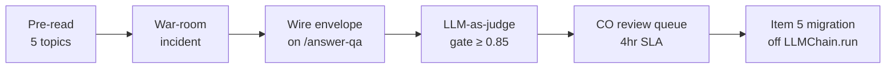

# W2 Thu — Day map: HITL #2 (RAG fallback)

> [!NOTE]
> **From Tue (D2):** the embedding-model misfire — "evaluation" in the query embedded near "evaluation of packaging" in a FAR 47 chunk. High similarity, wrong scope. That misfire is Thu's incident.

> [!IMPORTANT]
> **HITL #2 of 7** lands today (D-043 + D-044). Pre-read names the failure-mode taxonomy + envelope shape so the war-room is implementation, not surprise. The morning incident is yesterday's auto-published wrong-FAR-Part answer. By 17:00 the platform stops auto-publishing unreviewed answers.

## The five topics

| # | File | Anchor |
|---|------|--------|
| 2 | `runtime-faithfulness.md` | Why a grounded model still lies — three failure modes, RAGAS direction |
| 3 | `hitl-2-rag-fallback.md` | `needs_human_review` envelope shape + four reviewer actions |
| 4 | `rag-security-primer.md` | LLM01 indirect injection + LLM08 cross-tenant + PII at retrieval |
| 5 | `latency-tuning-rag.md` | Six hot-path calls + five tuning levers + parallel judges |
| 6 | `audit-trail-for-retrieval.md` | Correlation ID + append-only + Item 5 LLMChain migration |

> [!WARNING]
> Internet "RAG-in-90-min" tutorials commonly teach RAGAS **faithfulness as the sole metric**. It misses wrong-chunk retrieval — yesterday's exact failure shape. Always pair faithfulness with relevance (chunks→query). Topic 2 makes this explicit.

## Today's gate

By 17:00: HITL #2 envelope live, judge gate at threshold 0.85, CO queue with 4hr business-hours SLA, Item 5 `LLMChain.run()` migrated (D-033), yesterday's failing query in `qa.jsonl` as a regression fixture.

Tonight's reading map + thread context

- Pre-read budget Thu: ~35 min total at 100 wpm across 5 topic files + this overview.
- HITL thread: W1 Fri (#1) → **W2 Thu (#2, today)** → W3 Mon (#3) → W3 Wed (#4) → W3 Thu (#5, LangGraph `interrupt()`) → W4 Wed (#6, LLM06) → W5 Wed (#7).
- Tomorrow (Fri): RAG eval-harness build AM, **first Live Defense + first two-tier MCQ** PM.

Sources (all retrieved via /web-research per D-046)

- LangChain v1.0 — `create_agent` + HITL middleware + `interrupt()`: <https://docs.langchain.com/oss/python/langgraph/add-human-in-the-loop> — 2026-05-22
- AWS Bedrock Claude catalog: <https://docs.aws.amazon.com/bedrock/latest/userguide/> — 2026-05-22
- OWASP GenAI LLM Top 10 2025: <https://genai.owasp.org/llm-top-10/> — 2026-05-22
- MongoDB Atlas Vector Search: <https://www.mongodb.com/docs/atlas/atlas-vector-search/> — 2026-05-22
- RAGAS faithfulness: <https://docs.ragas.io/en/latest/concepts/metrics/available_metrics/faithfulness/> — 2026-05-26

Research briefs: `research/langchain-v1-20260522.md`, `research/bedrock-claude-catalog-20260522.md`, `research/owasp-llm-top-10-20260522.md`, `research/mongodb-atlas-vector-search-20260522.md`.

Last verified: 2026-06-03
