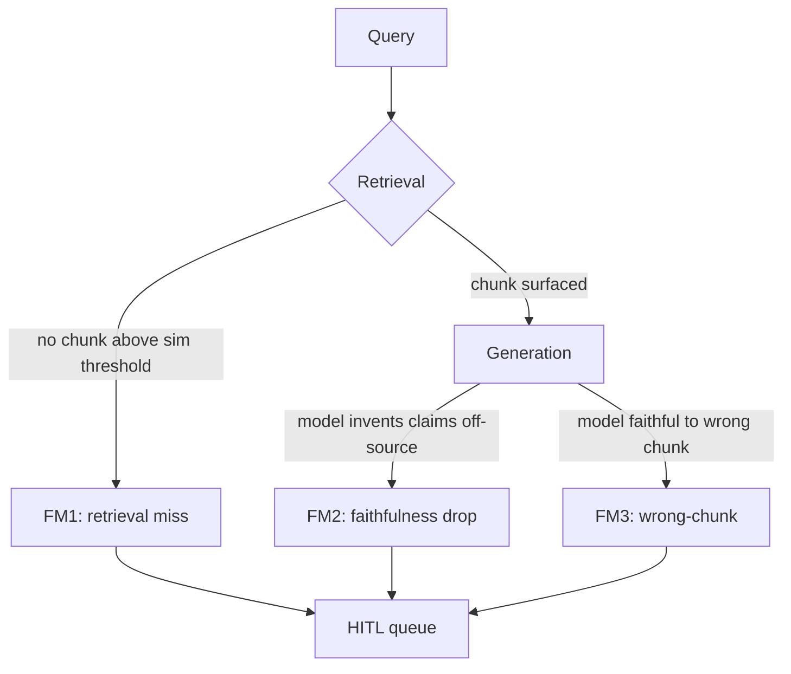

# Runtime faithfulness — how a grounded model still lies

> [!NOTE]
> **From Tue (D2):** an embedding-model misfire put a FAR 47 (transportation packaging) chunk in the top-k for a Section M (evaluation factors) query. High similarity, wrong scope. That misfire is failure mode #3 below.

## 1. Learning Objectives

- Define RAGAS **faithfulness** as a *response → chunks* metric and explain why direction matters.
- Distinguish the three production RAG failure modes and which metric catches each.
- Defend why a 0.92 faithfulness score is **not** sufficient evidence the answer is correct.
- Name the second axis (relevance / context precision) and where in the pipeline it gets computed.

## 2. Introduction

Teams shipping their first grounded RAG assume retrieval solves hallucination. A few months of incidents disagree. A grounded model still produces confident wrong answers — only now the answer carries a citation. The citation is just to the wrong source. From the outside this looks like a regular hallucination; from a postmortem perspective it is a *retrieval* defect that hides behind faithful composition. The Snorkel 2025 telemetry put a number on it: ~12% of "hallucination" tickets were actually retrieval defects faithfulness alone never surfaces. Yesterday's wrong-FAR-Part incident is one of those.

## 3. Core Concepts

### 3.1 The failure-mode tree



| Failure | Trigger | Why faithfulness alone misses it | What HITL #2 does |
|---|---|---|---|
| **FM1 Retrieval miss** | No chunk crosses similarity threshold | Caught upstream by top-k confidence | Route to queue, no draft to publish |
| **FM2 Faithfulness drop** | Model claims not entailed by chunks | Caught — faithfulness goes low | Route to queue, draft attached |
| **FM3 Wrong-chunk retrieval** | Chunk scope ≠ query scope (yesterday's incident) | **Missed** — answer IS faithful to a wrong chunk | Caught by a **second** axis (relevance) |

### 3.2 RAGAS faithfulness — direction matters

RAGAS faithfulness goes **response → chunks**: extract every claim in the response, ask the judge if each is entailed by the retrieved chunks, return the fraction supported (0–1). It does **not** ask whether the chunks were the right chunks. That direction is the whole point — and the whole limitation. The missing axis is **relevance** (chunks → query): does the chunk's scope match the query's expected scope? Yesterday's incident scored ~0.92 faithfulness and ~0.61 relevance. One axis would have shipped it; both axes catch it. The two scores are independent and the four quadrants of (F, R) need different downstream routing.

### 3.3 Four quadrants, three need humans

| Faithfulness | Relevance | What it means | Routing |
|---|---|---|---|
| high | high | Happy path | Auto-publish |
| low | high | Model went off-grounding | Re-prompt or escalate |
| **high** | **low** | **Confident answer from wrong source — yesterday's shape** | **Escalate** |
| low | low | Double failure | Escalate (priority) |

Three of four quadrants need review. The runtime gate is a **conjunction** — both scores must clear — not a single threshold.

> [!IMPORTANT]
> **0.85 conjunction is the defensible default.** Common production starting point: faithfulness ≥ 0.85 AND relevance ≥ 0.85 → auto-publish; anything else routes to review. Federal acquisitions has high false-negative cost (wrong answer = legal exposure), so the threshold sits high; loosen only when reviewer bandwidth is the binding constraint. Document the choice in an ADR (W3 Mon Plan Day pattern).

## 4. Generic Implementation

```python
# Generic two-axis RAG gate. Both scores must clear the threshold,
# or the response routes to a review queue rather than publishing.
import asyncio
from dataclasses import dataclass

THRESHOLD_FAITHFULNESS = 0.85
THRESHOLD_RELEVANCE = 0.85

@dataclass
class GatedResponse:
    status: str            # "publish" | "review_queue"
    response_text: str
    faithfulness: float
    relevance: float
    failure_mode: str | None

async def gate(query, response, chunks, judge) -> GatedResponse:
    # Two judges run in parallel — no data dependency on each other.
    f, r = await asyncio.gather(
        judge.faithfulness(response, chunks),   # response → chunks
        judge.relevance(query, chunks),         # chunks → query
    )
    if f >= THRESHOLD_FAITHFULNESS and r >= THRESHOLD_RELEVANCE:
        return GatedResponse("publish", response, f, r, None)
    failure = (
        "low_faithfulness" if f < THRESHOLD_FAITHFULNESS and r >= THRESHOLD_RELEVANCE
        else "low_relevance" if r < THRESHOLD_RELEVANCE and f >= THRESHOLD_FAITHFULNESS
        else "double_failure"
    )
    return GatedResponse("review_queue", response, f, r, failure)
```

Two scores ANDed against thresholds. `failure_mode` is preserved on the envelope so downstream (review UI, audit log, telemetry) can route retrieval bugs differently from generation bugs. Lives in `acquire-gov` at `services/ai-orchestrator/gates/runtime_gate.py`.

## 5. Real-world Patterns

**Fintech — transaction-anomaly explanation.** A consumer bank's RAG-grounded assistant explained flagged transactions to fraud analysts. Analysts reported the assistant "confidently citing the wrong policy" on edge cases. Postmortem: embeddings clustered policies by tone (formal vs customer-facing) more strongly than topic, so a wire-transfer-threshold query pulled a customer FAQ that *mentioned* wire transfers. Faithfulness high; relevance low. Adding the relevance axis dropped wrong-policy rate an order of magnitude.

**Healthcare — clinical-trial Q&A.** A pharma CRO's RAG covered current AND archived superseded trial protocols. High-similarity retrieval against an archived protocol scored well on faithfulness (answer matched the chunk) but was operationally wrong (the trial is now governed by the replacement). Fix: relevance scoring keyed on `protocol_version_status` — any archived chunk auto-scores zero on relevance regardless of similarity.

**Legal — contract-clause lookup.** A 2026 legal-tech evaluation reported targeting 90% faithfulness *and* 90% context-precision in production; below 70% on either dimension blocks entirely. The two-axis target is what made the system underwritable by their compliance team — a single faithfulness target would not have cleared.

## 6. Best Practices

- **Always compute two axes.** Faithfulness and relevance are independent; one metric hides FM3 in production.
- **Use a smaller distilled judge model on the hot path.** Distilled judges hit ≈85% human agreement at 10–50× lower cost than frontier judges.
- **Run the two judge calls in parallel.** No data dependency — `asyncio.gather` saves the second judge's wall-time entirely (~400ms typical).
- **Preserve `failure_mode` on the response envelope.** Downstream routing needs to distinguish retrieval bugs from generation bugs.
- **Tune thresholds by failure-cost asymmetry, not vibes.** Pick the FP-vs-FN trade-off explicitly, document it in an ADR, revisit on telemetry.
- **Block on judge unavailability.** Safe default is "route to queue," never "ship without evaluation."

> [!WARNING]
> **Anti-pattern: RAGAS faithfulness-only.** Most internet "RAG in 90 min" tutorials present `faithfulness` as the sole runtime gate. Faithfulness is necessary but not sufficient — it misses FM3 (wrong-chunk). Always pair with relevance / context-precision. Per `known-bad-patterns.yml` `ragas-faithfulness-only` (last reviewed 2026-05-11). Fri's harness wires all four RAGAS dimensions: **faithfulness, context-recall, context-precision, answer-relevance**.

## 7. Hands-on Exercise

Sketch a runtime gate for a *non-federal-acq* domain of your choice (healthcare imaging triage, fintech fraud-alert explainer, SaaS support, legal-tech contract Q&A): (a) two metrics with one-sentence definitions, (b) thresholds with cost-asymmetry justification keyed to your domain, (c) the `GatedResponse` envelope shape with required/optional fields marked, (d) one additional failure mode beyond the three in §3.1 your industry would care about and which metric would catch it. Bring this to the war-room — it ports to `acquire-gov` `/answer-qa` in block A.

> [!NOTE]
> **Self-check** (30s — answer mentally before expanding)
>
> 1. Which failure mode did yesterday's wrong-FAR-Part incident exhibit, and which axis catches it?
> 2. Why isn't a 0.92 faithfulness score sufficient evidence the answer is correct?

<details>
<summary>Show answers</summary>

1. **FM3 wrong-chunk retrieval.** Faithfulness was high (response matched the chunk); relevance was low (chunk scope = transportation packaging ≠ query scope = evaluation factors). The relevance axis (chunks → query) catches it.
2. Faithfulness only verifies the model stayed on-source. It doesn't verify the source was on-question. A high-faithfulness answer from the wrong chunk is a wrong answer with a citation — exactly yesterday's failure shape.

</details>

## 8. Key Takeaways

- Faithfulness is a *response → chunks* check; it ignores whether the chunks were the right chunks.
- Three failure modes (miss / faithfulness drop / wrong-chunk); two axes catch them; the gate is a conjunction.
- Thresholds come from cost-asymmetry analysis, not defaults; federal-acq tunes high.
- Distilled judges + parallel execution are the load-bearing implementation choices on the hot path.
- A high-faithfulness, low-relevance response is the dangerous quadrant — a wrong answer with a citation.

## 9. Sources

<details>
<summary>References — retrieved via /web-research per D-046</summary>

- <https://docs.ragas.io/en/stable/concepts/metrics/available_metrics/faithfulness/> — retrieved 2026-05-26 — hot-tech-3mo
- <https://snorkel.ai/blog/retrieval-augmented-generation-rag-failure-modes-and-how-to-fix-them/> — retrieved 2026-05-26
- <https://www.digitalocean.com/community/conceptual-articles/why-rag-systems-fail-in-production> — retrieved 2026-05-26
- <https://www.confident-ai.com/blog/rag-evaluation-metrics-answer-relevancy-faithfulness-and-more> — retrieved 2026-05-26
- <https://www.digitalapplied.com/blog/rag-system-metrics-recall-precision-faithfulness-2026> — retrieved 2026-05-26

</details>

<details>
<summary>Deeper dive — judge-model selection + cost asymmetry</summary>

- **Judge selection:** distilled small judges hit ≈85% human agreement at 10–50× lower cost than frontier judges on calibrated rubrics. Karsun pick: Claude Haiku 4.5 on Bedrock (`anthropic.claude-haiku-4-5-20251001-v1:0`). Using the frontier model as both generator and judge wastes latency and money without raising quality — same-family judges actually score their family's outputs ~4–8 points more leniently.
- **Cost asymmetry framework:** in domains where wrong answers create legal/financial exposure (federal acquisitions, healthcare, finance), false-negatives dominate and thresholds tune high (0.90+). In domains where reviewer bandwidth is the binding constraint (high-volume support, content moderation at scale), false-positives dominate and thresholds sit lower with periodic sampling instead. Document the asymmetry in an ADR.
- **Threshold tightening over time:** start at 0.85 conjunction; as the QA set grows past 50 rows and judge calibration tightens, push to 0.90. The decision lives in a revisitable ADR with explicit revisit triggers ("revisit when QA set exceeds 200 rows OR judge disagreement drops below 0.05").
- **Snorkel telemetry (2025):** ~12% of "hallucination" tickets were actually retrieval defects faithfulness alone cannot surface. That number is the headline reason the relevance axis is non-negotiable in regulated systems.
- **Drift monitoring:** threshold drift is real. Sample 1–2% of auto-published responses for offline re-evaluation against a stronger eval set; if scores drift, the threshold needs re-tuning before customers find it.

</details>

Last verified: 2026-06-03
