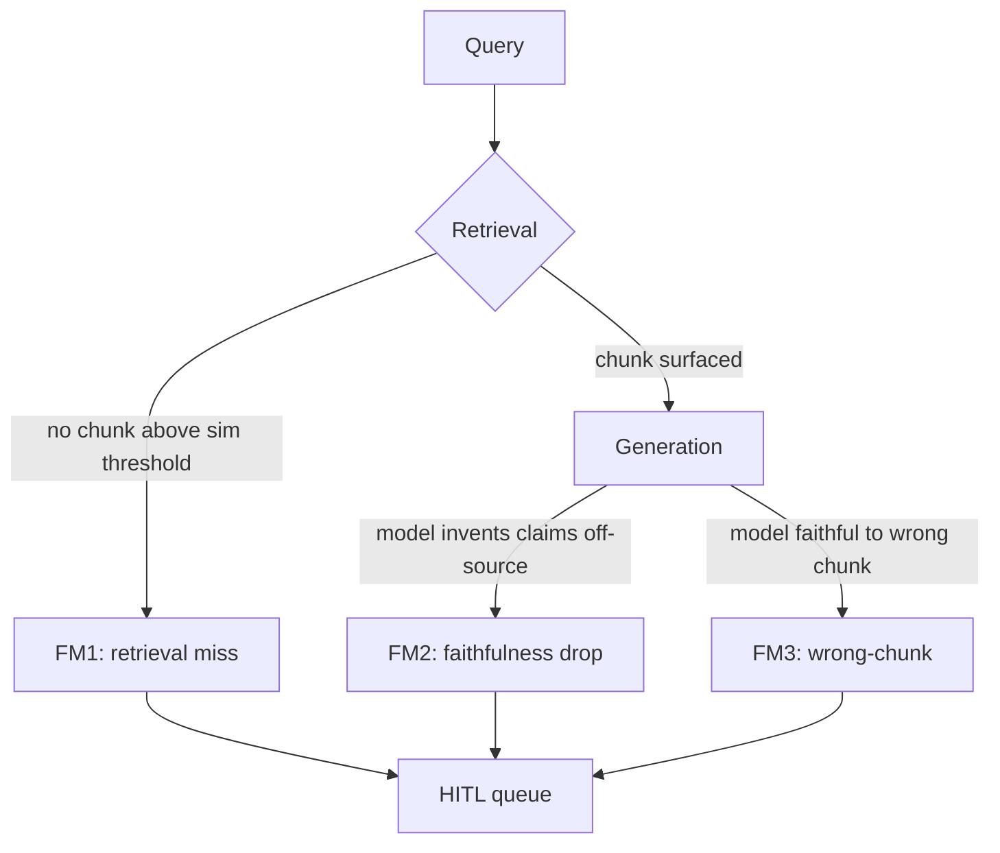

# Runtime faithfulness — how a grounded model still lies

> [!NOTE]
> **From Tue (D2):** an embedding-model misfire put a FAR 47 (transportation packaging) chunk in the top-k for a Section M (evaluation factors) query. High similarity, wrong scope. That's failure mode #3 below.

## The failure-mode tree

A grounded model can still ship confidently-wrong answers — only now the answer has a citation. Three modes worth holding:

| Failure | Trigger | Why faithfulness alone misses it | What HITL #2 does |
|---|---|---|---|
| **FM1 Retrieval miss** | No chunk crosses similarity threshold | Caught upstream by top-k confidence | Route to queue, no draft to publish |
| **FM2 Faithfulness drop** | Model claims not entailed by chunks | Caught — faithfulness goes low | Route to queue, draft attached |
| **FM3 Wrong-chunk retrieval** | Chunk scope ≠ query scope (yesterday's incident) | **Missed** — answer IS faithful to a wrong chunk | Caught by a **second** axis (relevance) |

## RAGAS faithfulness — direction matters

RAGAS faithfulness goes **response → chunks**: extract every claim in the response, ask the judge if each is entailed by the retrieved chunks, return the fraction supported (0–1). It does **not** ask whether the chunks were the right chunks. That direction is the whole point — and the whole limitation.

The missing axis is **relevance** (chunks → query): does the chunk's scope match the query's expected scope? Yesterday's incident scored ~0.92 faithfulness and ~0.6 relevance. One axis would have shipped it; both axes catch it.

> [!WARNING]
> **Anti-pattern: RAGAS faithfulness-only.** Most internet "RAG in 90 min" tutorials present RAGAS `faithfulness` as the sole runtime gate. Faithfulness is necessary but not sufficient — it misses FM3 (wrong-chunk). Always pair with relevance / context-precision. Per `known-bad-patterns.yml` `ragas-faithfulness-only` (last reviewed 2026-05-11). Fri's harness wires all four RAGAS dimensions: **faithfulness, context-recall, context-precision, answer-relevance**.

## Threshold convention

Common production starting point: faithfulness ≥ 0.85 AND relevance ≥ 0.85 → auto-publish; anything else routes to review. Tighten when false-negative cost dominates (federal-acq: yes); loosen when reviewer bandwidth is the binding constraint. Document the choice in an ADR (W3 Mon Plan Day pattern).

## Self-check

> [!NOTE]
> **Self-check** (30s — answer mentally first)
>
> 1. Which failure mode did yesterday's wrong-FAR-Part incident exhibit, and which axis catches it?
> 2. Why isn't a 0.92 faithfulness score sufficient evidence the answer is correct?

Show answers

1. **FM3 wrong-chunk retrieval.** Faithfulness was high (response matched the chunk); relevance was low (chunk scope = transportation packaging ≠ query scope = evaluation factors). The relevance axis (chunks → query) catches it.
2. Faithfulness only verifies the model stayed on-source. It doesn't verify the source was on-question. A high-faithfulness answer from the wrong chunk is a wrong answer with a citation.

Deeper dive — judge-model selection + cost asymmetry

- Judge model: distilled small judges hit ≈85% human agreement at 10–50× lower cost than frontier judges on calibrated rubrics. Karsun pick: Claude Haiku 4.5 on Bedrock (`anthropic.claude-haiku-4-5-20251001-v1:0`).
- Four quadrants: high-F high-R = ship; low-F high-R = re-prompt or escalate; **high-F low-R = the dangerous case, escalate**; low-F low-R = escalate. Three of four quadrants need humans — the gate is a *conjunction*.
- Snorkel telemetry (2025): ~12% of "hallucination" tickets were actually retrieval defects faithfulness alone cannot surface.
- Cost asymmetry: in domains where wrong answers create legal/financial exposure, tune thresholds high (false-negatives dominate). Federal acquisitions sits firmly in that bucket.

Sources (retrieved via /web-research per D-046)

1. RAGAS faithfulness: <https://docs.ragas.io/en/stable/concepts/metrics/available_metrics/faithfulness/> — 2026-05-26
2. Snorkel — RAG failure modes: <https://snorkel.ai/blog/retrieval-augmented-generation-rag-failure-modes-and-how-to-fix-them/> — 2026-05-26
3. DigitalOcean — why RAG fails in production: <https://www.digitalocean.com/community/conceptual-articles/why-rag-systems-fail-in-production> — 2026-05-26
4. Confident AI — RAG eval metrics: <https://www.confident-ai.com/blog/rag-evaluation-metrics-answer-relevancy-faithfulness-and-more> — 2026-05-26
5. DigitalApplied — RAG metrics 2026: <https://www.digitalapplied.com/blog/rag-system-metrics-recall-precision-faithfulness-2026> — 2026-05-26

Last verified: 2026-06-03
