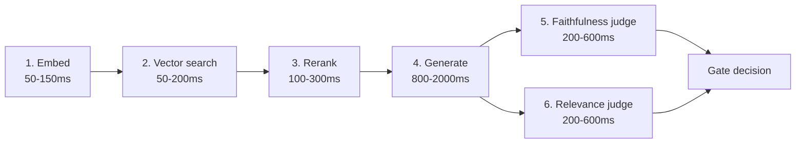

# Latency tuning — the hidden tax of grounding

> [!NOTE]
> **From Tue (D2):** the `/rag/clause-search` budget was 800ms because there was no LLM completion on the hot path. `/answer-qa` adds completion + two judges — the budget triples.

## The six sequential hot-path calls

Calls 5 and 6 are independent — both consume `(response, chunks)`. **Run them in parallel**. Serial judges is a default-bug that ships unless someone fixes it. `asyncio.gather` saves ~400ms typical.

## Five tuning levers

| Lever | Class | Trade-off |
|---|---|---|
| **Embedding cache** | quality-preserving | Hit on normalised-query repeat → skip call 1. Invalidation logic is the cost. |
| **`numCandidates` tune** | quality-trading | Higher = better recall, slower call 2. Tune against held-out recall@k. |
| **Rerank cascade** | preserving + improving | `retrieve 50 → cheap rerank to 20 → cross-encoder to 5` is faster *and* often higher quality than single expensive pass. |
| **Smaller judge model** | quality-trading | Distilled judges hit ≈85% human agreement at 10–50× lower cost. Validate on a slice-level eval. |
| **Parallelize judges** | pure win | No data dependency. ~400ms saved. Ship by default. |

> [!CAUTION]
> **Anti-pattern: over-eager LLM-as-judge spend.** A flood of "evaluate every response with a frontier judge" advice now circulates online. Judging every response with a frontier model doubles inference cost AND increases p95 by hundreds of ms — for ~3% agreement improvement over a distilled judge on calibrated rubrics. Karsun pick: Claude Haiku 4.5 (`anthropic.claude-haiku-4-5-20251001-v1:0`) for judge calls; reserve the frontier model for primary generation. Per D-060, real `InvokeModel` from request 1 — no mocks.

## Quality-preserving vs quality-trading

| Class | Examples | Ship-gate |
|---|---|---|
| **Preserving** | Embedding/result/KV cache, judge parallelization, batching | No eval re-run; ship after smoke test |
| **Trading** | Smaller embedding/judge/primary model, lower `numCandidates`, shallower rerank | Slice-level eval harness required (Fri's topic) |

Implement preserving first. Trading-level changes block on Fri's harness. A 30% latency win that drops faithfulness 12% on a slice that matters is not a win.

## Self-check

> [!NOTE]
> **Self-check** (30s)
>
> 1. Why is parallelizing the two judge calls a pure win with no quality trade-off?
> 2. You see an aggregate faithfulness metric unchanged after switching to a smaller embedding model. Is it safe to ship?

Show answers

1. The two judges have no data dependency on each other — both consume `(response, chunks)`. They produce independent scores. Running them concurrently via `asyncio.gather` halves their wall-time without changing what they compute.
2. Not without a slice-level check. An aggregate-neutral change can still regress a per-slice population (specific query types, specific tenants, specific topics) — different cluster geometry in the new embedding model favours some inputs and disfavours others. Smaller embedding model is a quality-trading change; it ships only after the Fri harness validates the slices that matter.

Deeper dive — KV-cache + result-cache

- **KV-cache for repeated chunks**: when a small set of chunks gets retrieved across many requests (common — a few popular topics dominate the query distribution), cache the LLM's key-value tensors for those chunks. RAGCache reports 1.6× throughput, 2× latency reduction on LLaMA-3 workloads.
- **Result-cache on identical normalised queries**: same `(normalise(query), tenant)` → cached response, skipping the entire pipeline. 20–40% hit-rates reported for high-volume FAQ-style endpoints. Cache invalidation on corpus version change is the discipline cost — stale cache hits are silent quality regressions.

Sources (retrieved via /web-research per D-046)

1. RAG Latency Playbook: <https://python.plainenglish.io/the-rag-latency-playbook-batching-caching-scope-reduction-reranking-and-graph-rag-b85dae5cdfb7> — 2026-05-26
2. Supercharge Your RAG: <https://medium.com/@_Ankit_Malviya/supercharge-your-rag-the-complete-guide-to-lightning-fast-retrieval-augmented-generation-8b1419f4aed4> — 2026-05-26
3. Reducing Retrieval Latency by 60% — case study: <https://devilsdev.github.io/rag-pipeline-utils/blog/reducing-retrieval-latency-case-study> — 2026-05-26
4. LLM-as-Judge Best Practices 2026: <https://futureagi.com/blog/llm-as-judge-best-practices-2026> — 2026-05-26
5. Production-Ready RAG at Scale: <https://dev.to/qlooptech/how-to-build-production-ready-rag-systems-at-scale-with-low-latency-high-accuracy-819> — 2026-05-26

Last verified: 2026-06-03
