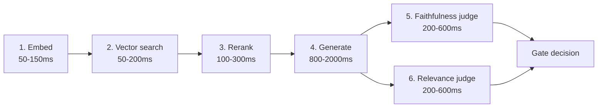

# Latency tuning — the hidden tax of grounding

> [!NOTE]
> **From Tue (D2):** the `/rag/clause-search` budget was 800ms because there was no LLM completion on the hot path. `/answer-qa` adds completion + two judges from topic 2 — the budget triples. The hidden tax of grounding is real.

## 1. Learning Objectives

- Enumerate the **six sequential calls** on the gated RAG hot path and the typical latency budget for each.
- Identify the **five tuning levers** and what each trades off.
- Explain why judge calls should be parallelized and how much wall-time that saves.
- Distinguish **quality-preserving** optimizations from **quality-trading** ones and the engineering implication for each.

## 2. Introduction

A naive RAG description suggests a single LLM call. Production reality is closer to six: embed, search, optionally rerank, generate, score faithfulness, score relevance. Each is an independent network round-trip; total latency is the sum unless calls are deliberately overlapped. This is the **hidden tax of grounding** — 800ms before grounding becomes 2.5s after. Worse, most latency optimizations trade quality elsewhere: smaller embedding = less discriminating; shallower rerank = misses second-tier matches; smaller judge = lower human agreement. The discipline is knowing which trade-offs you're making and how to measure them.

## 3. Core Concepts

### 3.1 The six sequential hot-path calls



Calls 5 and 6 are independent — both consume `(response, chunks)`. **Run them in parallel.** Serial judges is a default-bug that ships unless someone fixes it. `asyncio.gather` saves ~400ms typical. Real production budgets compress the sum: under 800ms for read-fast endpoints, 2–3s for endpoints where users accept some thinking time.

### 3.2 Five tuning levers

| Lever | Class | Trade-off |
|---|---|---|
| **Embedding cache** | quality-preserving | Hit on normalised-query repeat → skip call 1. Invalidation logic is the cost. |
| **`numCandidates` tune** | quality-trading | Higher = better recall, slower call 2. Tune against held-out recall@k. |
| **Rerank cascade** | preserving + improving | `retrieve 50 → cheap rerank to 20 → cross-encoder to 5` is faster *and* often higher quality than single expensive pass. |
| **Smaller judge model** | quality-trading | Distilled judges hit ≈85% human agreement at 10–50× lower cost. Validate on a slice-level eval. |
| **Parallelize judges** | pure win | No data dependency. ~400ms saved. Ship by default. |

The lever that costs nothing is *parallelizing judges*. They have no data dependency on each other; serializing them is a bug that ships unless someone explicitly fixes it.

### 3.3 Quality-preserving vs quality-trading

| Class | Examples | Ship-gate |
|---|---|---|
| **Preserving** | Embedding/result/KV cache, judge parallelization, batching | No eval re-run; ship after smoke test |
| **Trading** | Smaller embedding/judge/primary model, lower `numCandidates`, shallower rerank | Slice-level eval harness required (Fri's topic) |

Implement preserving first. Trading-level changes block on Fri's harness. A 30% latency win that drops faithfulness 12% on a slice that matters is not a win — aggregate metrics stay flat while per-slice quality regresses for an underrepresented query type. The harness is the gating dependency for any latency optimization that touches model selection.

> [!IMPORTANT]
> **Measure p95 (or p99), not average.** Latency tails are where users notice; averages hide tail problems. A "30% improvement" measured at 5 RPS doesn't necessarily hold at 50 RPS — saturation behaviour matters. Load-test before tuning, not after.

## 4. Generic Implementation

```python
# Generic latency-optimized RAG with four quality-preserving wins:
# (1) embedding cache, (2) rerank cascade, (3) parallel judges, (4) result cache.
# Lives in acquire-gov at services/ai-orchestrator/runtime/fast_path.py
import asyncio
from cachetools import TTLCache

EMBEDDING_CACHE = TTLCache(maxsize=50_000, ttl=86_400)
RESULT_CACHE    = TTLCache(maxsize=10_000, ttl=3600)

async def embed_with_cache(query: str) -> list[float]:
    key = normalise(query)
    if key in EMBEDDING_CACHE:
        return EMBEDDING_CACHE[key]
    vec = await embedding_client.embed(query)
    EMBEDDING_CACHE[key] = vec
    return vec

async def rerank_cascade(query, candidates):
    mid = await cheap_reranker.rerank(query, candidates, top=20)  # 50 → 20
    return await cross_encoder.rerank(query, mid, top=5)          # 20 → 5

async def answer(query: str, tenant_id: str) -> dict:
    cache_key = (normalise(query), tenant_id)
    if cache_key in RESULT_CACHE:
        return RESULT_CACHE[cache_key]
    query_vec  = await embed_with_cache(query)
    candidates = await vector_store.search(query_vec, tenant_id=tenant_id,
                                           num_candidates=100, k=20)
    chunks     = await rerank_cascade(query, candidates)
    response   = await primary_llm.generate(query, chunks)
    f, r = await asyncio.gather(                                  # parallel judges
        judge_model.score_faithfulness(response, chunks),
        judge_model.score_relevance(query, chunks),
    )
    result = {"response": response, "chunks": chunks,
              "faithfulness": f, "relevance": r}
    RESULT_CACHE[cache_key] = result
    return result
```

Four wins applied: embedding-result cache, rerank cascade (cheap → cross-encoder), parallel judges via `asyncio.gather`, full-result cache on identical normalised query. No `Chain` subclass, no LCEL `|` pipe (D-033).

## 5. Real-world Patterns

**SaaS — customer-support assistant.** B2B SaaS cut p95 from 4.1s to 1.8s through three changes: embedding-cache for normalised question forms (31% hit rate); rerank cascade replacing a single expensive cross-encoder; parallelizing the runtime judges. None changed model selection — no eval re-run required. Pure latency win.

**Fintech — research-assistant.** An equity-research firm's assistant retrieves earnings calls + analyst reports. Production traffic showed 40% of queries were variants of "how did COMPANY do in QUARTER" — perfect for both result caching (keyed by company × quarter) and KV-cache of most-retrieved chunks. Caching alone gave 2× latency improvement on that slice.

**E-commerce — review-summarisation.** A marketplace's endpoint had judge calls at 30% of wall time, sequential. Parallelizing via `asyncio.gather` dropped p95 by ~400ms with zero changes elsewhere. They *didn't* swap to a distilled judge — it would have saved 600ms but regressed faithfulness 4% on a slice they cared about. Harness made the trade-off legible.

**Logistics — fleet-ops.** Bottleneck was embedding latency — inputs were full operator monologues (200–500 words) not short questions. Fix: smaller faster embedding model + eval-driven validation the swap didn't regress monologue retrieval. Quality-trading required the harness.

## 6. Best Practices

- **Implement quality-preserving optimizations first** (caching, parallelization, batching) — no eval re-run, pure wins where applicable.
- **Parallelize judges by default.** No data dependency; serial judges is an `asyncio.gather`-shaped bug.
- **Validate quality-trading optimizations against a slice-level eval harness**, not just an aggregate metric.
- **Cache with deliberate invalidation** on corpus version change. Stale-cache hits are silent quality regressions.
- **Measure p95 (or p99), not average.** Tails are where users notice.
- **Load-test before tuning, not after.** Saturation behaviour matters.
- **Budget each step in your design doc.** "Embed 100ms, search 150ms, rerank 200ms, generate 1.5s, judges parallel 500ms" is testable; "we'll optimize later" is not.

> [!CAUTION]
> **Anti-pattern: over-eager LLM-as-judge spend.** A flood of "evaluate every response with a frontier judge" advice now circulates online. Judging every response with a frontier model doubles inference cost AND increases p95 by hundreds of ms — for ~3% agreement improvement over a distilled judge on calibrated rubrics. Karsun pick: Claude Haiku 4.5 (`anthropic.claude-haiku-4-5-20251001-v1:0`) for judge calls; reserve the frontier model for primary generation. Per D-060, real `InvokeModel` from request 1 — no mocks.

## 7. Hands-on Exercise

Tune the latency of a RAG-backed assistant in a non-acquisitions domain (healthcare imaging-report Q&A, fintech research tool, logistics ops assistant). Current p95 = 3.8s; target = 1.5s. Sketch (a) the six steps with your latency-contribution estimate per step in this domain, (b) three first changes — at least two must be quality-preserving, at most one quality-trading, (c) the eval check before shipping the quality-trading change with slice-level breakdown, (d) one change you would NOT make and why the trade-off doesn't work for this domain. War-room block D applies the same logic to `/answer-qa` — yesterday's measured p95 + the parallel-judges fix.

> [!NOTE]
> **Self-check** (30s)
>
> 1. Why is parallelizing the two judge calls a pure win with no quality trade-off?
> 2. You see an aggregate faithfulness metric unchanged after switching to a smaller embedding model. Is it safe to ship?

<details>
<summary>Show answers</summary>

1. The two judges have no data dependency on each other — both consume `(response, chunks)` and produce independent scores. Running them concurrently via `asyncio.gather` halves their wall-time without changing what they compute. The output is identical to serial execution; only wall-clock latency drops.
2. Not without a slice-level check. An aggregate-neutral change can still regress a per-slice population (specific query types, specific tenants, specific topics) — different cluster geometry in the new embedding model favours some inputs and disfavours others. Smaller embedding model is a quality-trading change; it ships only after the Fri harness validates the slices that matter.

</details>

## 8. Key Takeaways

- Six sequential hot-path calls; the primary generation usually dominates; judges are the cost grounding adds on top.
- Five tuning levers split between quality-preserving (cache + parallelize + cascade) and quality-trading (smaller models, fewer candidates).
- Quality-preserving optimizations ship after smoke test; quality-trading optimizations block on the eval harness.
- Parallelizing judges via `asyncio.gather` is the pure-win lever — ~400ms saved, no quality impact.
- p95 and slice-level metrics are load-bearing — aggregate-neutral changes can still regress slices that matter.

## 9. Sources

<details>
<summary>References — retrieved via /web-research per D-046</summary>

- <https://python.plainenglish.io/the-rag-latency-playbook-batching-caching-scope-reduction-reranking-and-graph-rag-b85dae5cdfb7> — retrieved 2026-05-26 — hot-tech-3mo
- <https://medium.com/@_Ankit_Malviya/supercharge-your-rag-the-complete-guide-to-lightning-fast-retrieval-augmented-generation-8b1419f4aed4> — retrieved 2026-05-26
- <https://devilsdev.github.io/rag-pipeline-utils/blog/reducing-retrieval-latency-case-study> — retrieved 2026-05-26
- <https://futureagi.com/blog/llm-as-judge-best-practices-2026> — retrieved 2026-05-26
- <https://dev.to/qlooptech/how-to-build-production-ready-rag-systems-at-scale-with-low-latency-high-accuracy-819> — retrieved 2026-05-26

</details>

<details>
<summary>Deeper dive — KV-cache + result-cache + cache-invalidation discipline</summary>

- **KV-cache for repeated chunks**: when a small set of chunks gets retrieved across many requests (common — a few popular topics dominate the query distribution), cache the LLM's key-value tensors for those chunks. RAGCache reports 1.6× throughput, 2× latency reduction on LLaMA-3 workloads with chunk-aware cache management. The cache layer is between the inference framework and the model; not all serving stacks support it equally.
- **Result-cache on identical normalised queries**: same `(normalise(query), tenant)` → cached response, skipping the entire pipeline. 20–40% hit-rates reported for high-volume FAQ-style endpoints. The discipline cost is invalidation on corpus version change — stale cache hits are silent quality regressions that look like the system suddenly got worse with no code change.
- **ARC (Active Retrieval Caching)** reports up to 80% retrieval-latency reduction using ~0.015% of the corpus as a hot cache, with a learned admission policy that pushes high-recurrence-likelihood chunks into the cache layer ahead of repeat queries.
- **Saturation behaviour**: a "30% improvement" measured at 5 RPS often doesn't hold at 50 RPS. The judge model in particular saturates differently than the primary model because the request shape (smaller, more frequent) hits different backend bottlenecks. Load-test the *composition* — primary + parallel judges — not each call in isolation.
- **Co-optimization trap**: the hardest engineering case is a tuning win that *appears* quality-preserving but isn't. Switching to a smaller embedding model that scores almost identically on aggregate recall@k but produces subtly different cluster geometry favours some kinds of queries and disfavours others. The fix is slice-level eval — and the harness is the gating dependency the team builds Friday.

</details>

Last verified: 2026-06-03
