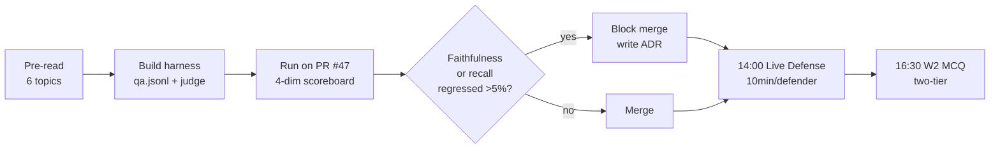

# W2 Fri — Day map: eval harness + Live Defense + MCQ

> [!NOTE]
> **From Thu (D4):** HITL #2 wired with the **0.85 conjunction gate** (faithfulness ≥ 0.85 AND relevance ≥ 0.85) and a 4hr CO queue SLA. Today's harness is what *measures* whether a PR holds that gate — Thu wired the runtime, Fri wires the regression test.

> [!IMPORTANT]
> **Three things stacked.** AM: build the RAG eval harness from scratch against PR #47 (a real chunking tweak that won 30% latency but may have regressed faithfulness). PM 14:00: **first Live Defense of the programme** — one defender per pair, 10 min, defending a W02 scenario-alternative ADR. PM 16:30: **first standard two-tier W2 MCQ** (senior + entry — different from W1 Light). Evidence not vibes is the whole day.

## The six topics

| # | File | Anchor |
|---|------|--------|
| 2 | `building-a-rag-eval-harness-from-scratch.md` | Flat-file `qa.jsonl` + runner — JSONL-in-repo beats hosted dashboard |
| 3 | `llm-as-judge-for-retrieval-eval.md` | Per-band rubric + N=3 sampling + 0.1 calibration bar |
| 4 | `eval-as-test-fixture-and-regression-framing.md` | PR comment + 5% block gate + branch-protection wiring |
| 5 | `iterative-improvement-loops-eval-fix-re-eval.md` | One variable at a time + metric-to-layer mapping |
| 6 | `security-eval-extension-prompt-injection-probes.md` | 3-5 probe starter for LLM01 — tee-up for W4 |
| 7 | `w3-mon-plan-day-preview-and-live-defense-expectations.md` | §0 retro + defense rubric + W3 agentic preview |

> [!WARNING]
> Internet "RAG-in-90-min" eval tutorials repeatedly demo with **5-row QA sets** + faithfulness-only scoring. Both are anti-patterns: 5 rows are inside the noise floor (any threshold is meaningless), and faithfulness-only misses the wrong-chunk failure Thu just shipped HITL #2 to catch. Today's harness wires **all four RAGAS dimensions** against a 20-30 row curated set, with judge calibration. Topic 3 makes calibration explicit.

## Today's gate

By 12:00: 4-dimension harness running in CI on PR #47; ship/no-ship decision committed on the PR with harness evidence; 20-30 row `qa.jsonl` committed; OIG-style finding opened against acquire-gov for the remaining disabled GHA lint workflow (debt Item 12 partial close). By 17:00: Live Defense scored, MCQ submitted, 3 pair retros + 1 cohort retro feeding W3 Mon §0.

Tonight's reading map + thread context

- Pre-read budget Fri: ~38 min at 100 wpm across 6 topic files + this overview.
- HITL thread continues: W2 Thu (#2 wired today gets *measured*) → W3 Mon (#3, Plan-Day ADR — §0 retro consumes this week's evidence) → W3 Wed (#4) → W3 Thu (#5, LangGraph `interrupt()`) → W4 Wed (#6, LLM06) → W5 Wed (#7).
- LangSmith deferred to **W5 per D-031** — Fri's harness is flat-file + GHA on purpose. The discipline (write QA set first, then the system) is the muscle memory W3 inherits and W5 productionises.
- Wed-PM dedicated research slot (D-040) feeds the W02 scenario-alternative being defended at 14:00.
- W3 Mon §0 retro (D-036) is the **first formal plan-retrospective in the programme** — your honest retro inputs Fri EOD become its data.

Sources (all retrieved via /web-research per D-046)

- RAGAS metrics overview: <https://docs.ragas.io/en/latest/concepts/metrics/> — 2026-05-26
- Anthropic — Evaluating AI systems: <https://www.anthropic.com/news/evaluating-ai-systems> — 2026-05-26
- GitHub Actions — Reusable workflows: <https://docs.github.com/en/actions/sharing-automations/reusing-workflows> — 2026-05-26
- Bedrock Claude catalog: <https://docs.aws.amazon.com/bedrock/latest/userguide/models-supported.html> — 2026-05-26
- LangSmith eval (DO NOT IMPLEMENT W2 — D-031): <https://docs.smith.langchain.com/evaluation> — 2026-05-26
- LangChain v1.0 posture (D-033): <https://docs.langchain.com/oss/python/releases/langchain-v1> — 2026-05-22

Research briefs: `research/langchain-v1-20260522.md`, `research/bedrock-claude-catalog-20260522.md`.

Last verified: 2026-06-03
