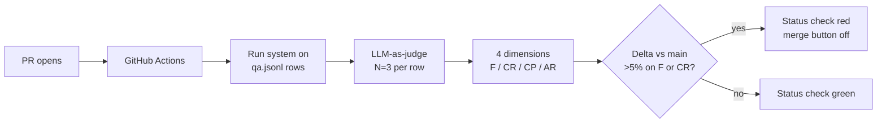

# Building a RAG eval harness from scratch — flat-file qa.jsonl

> [!NOTE]
> **From Thu:** three failure modes (retrieval miss / faithfulness drop / wrong-chunk) feed one queue. Today's harness *measures* all three at PR time so the gate Thu wired stays held PR over PR. PR #47 is the test case — claims 30% latency win but may have broken faithfulness.

## 1. Learning Objectives

- Design a QA row schema that grades retrieval and generation independently.
- Curate a 20-30 row seed `qa.jsonl` from real federal-acq sources without fabrication.
- Wire all four RAGAS dimensions (faithfulness / context recall / context precision / answer relevance) against the seed.
- Identify when to graduate from flat-file to hosted (LangSmith etc — deferred to W5 per D-031).

## 2. Introduction

The harness is the regression test that prevents PR-by-PR drift in a runtime quality property. Without it, the 0.85 conjunction gate Thu wired stays held only by luck across the next 100 PRs. A grounded RAG system has at least four failure dimensions (recall, precision, faithfulness, relevance) and the harness needs to score all four — a faithfulness-only harness ships the same wrong-chunk failures HITL #2 was wired to catch. Flat-file `qa.jsonl` is right until at least one of three things forces a graduation; below that bar, JSONL-in-repo wins because every row's history is in `git log` and every addition is a reviewable PR.

## 3. Core Concepts

### 3.1 The QA row schema



Five fields are the minimum useful row — anything less and the harness can't grade retrieval and generation independently:

| Field | Purpose |
|---|---|
| `query` | Input string as a user would send it |
| `ground_truth_answer` | Canonical answer a domain expert would accept |
| `expected_chunks` | Chunk IDs that *should* be retrieved (recall denominator) |
| `corpus_sources_expected` | Which corpora must contribute (catches cross-corpus misfires) |
| `metadata` | Provenance — source URL/ticket-ID, curator, date added |

Richer rows add `difficulty`, `failure_modes_targeted` (e.g., `cross-corpus-precedence`, `tenant-isolation`), and curator `notes`. Richer metadata = sliceable scoreboard later.

### 3.2 Curation rule: never fabricate

Real federal-acq sources only. Fabricated rows encode the curator's (or model's) existing biases — the harness becomes a self-fulfilling prophecy. Today's 20-30 row seed:

| Source | Coverage |
|---|---|
| Tue's `test_tenant_boundary.py` (Item 10 pin-test) | Stays as pin; harness adds the dimensional measure on top |
| Thu's 1-row FAR 47.305-2 wrong-chunk fixture | Stays as pin; same logic |
| 15+ rows from FedBizOpps Q&A logs / SBA archives / GAO bid-protest decisions via `/web-research` | Real evidence with source URLs in row metadata |

Rows without provenance go to `qa-unverified.jsonl` and **do not gate merges**. Verified rows gate.

### 3.3 When to graduate to hosted

Flat-file is right until at least one of: QA set >500 rows, >3 contributors editing concurrently, or eval needs to run against production traffic samples. Below all three, JSONL-in-repo wins — every row's history is in `git log`, every addition is a reviewable PR, the dataset is the same code-review surface as the system it grades. **LangSmith deferred to W5 per D-031.** The discipline (write QA set first, then the system) is the muscle memory W3 inherits and W5 productionises.

> [!IMPORTANT]
> **All four RAGAS dimensions, not just faithfulness.** Faithfulness-only ships the wrong-chunk failure mode HITL #2 was wired to catch. The four are: **faithfulness** (response → chunks), **context recall** (expected → retrieved), **context precision** (retrieved → relevant), **answer relevance** (response → query). All four mandatory per `ragas-faithfulness-only` blocklist.

## 4. Generic Implementation

```python
# tests/eval/run_eval.py — boring on purpose
# Lives in acquire-gov at tests/eval/run_eval.py + qa.jsonl + judge.py
import json
from pathlib import Path
from system_under_test import answer_query  # the RAG pipeline being graded

DATASET = Path("tests/eval/qa.jsonl")
RESULTS = Path("tests/eval/results.jsonl")

def load_rows(path):
    with path.open() as f:
        for line in f:
            line = line.strip()
            if line and not line.startswith("#"):
                yield json.loads(line)

def grade_retrieval(retrieved_chunks, expected_chunks):
    """Recall + precision on chunk IDs — deterministic, fast."""
    retrieved_ids = {c["id"] for c in retrieved_chunks}
    expected_ids = set(expected_chunks)
    if not expected_ids:
        return {"recall": None, "precision": None}
    recall = len(retrieved_ids & expected_ids) / len(expected_ids)
    precision = (len(retrieved_ids & expected_ids) / len(retrieved_ids)) if retrieved_ids else 0.0
    return {"recall": recall, "precision": precision}

def main():
    with RESULTS.open("w") as out:
        for row in load_rows(DATASET):
            response = answer_query(row["query"])
            retrieval_scores = grade_retrieval(response.retrieved_chunks, row["expected_chunks"])
            out.write(json.dumps({
                "row_id": row.get("id"),
                "query": row["query"],
                "answer": response.answer,
                "retrieval": retrieval_scores,
                # LLM-as-judge layer lives in tests/eval/judge.py (topic 3)
            }) + "\n")

if __name__ == "__main__":
    main()
```

Plain Python composition. No `Chain` subclass. No LCEL `|` pipe. No `chain.run()`. Per D-033 + `known-bad-patterns.yml` IDs `langchain-chain-class`, `langchain-lcel-pipe`, `langchain-chaining-verb`.

## 5. Real-world Patterns

**Fintech — chargeback assistant.** A consumer-bank's chargeback assistant moved recall 0.526 → 0.738 by iterating chunking against a JSONL harness curated from historical disputes. The harness predated the LangSmith deployment; flat-file proved sufficient through 200+ rows. The team graduated to hosted only when three product squads started contributing rows concurrently.

**Healthcare — medication-safety triage.** A medication-interaction system's harness exposed a 13.3% gap between high-risk and low-risk slices that a single aggregate score would have hidden. The lesson: row `metadata.difficulty` + `metadata.failure_modes_targeted` is what makes slice-level reporting possible. Without those fields the harness reports a green aggregate while a critical slice silently regresses.

**E-commerce — product Q&A.** A marketplace kept JSONL as the *authoring surface* even after moving to a hosted platform: platform = dashboard, JSONL in `git log` = source of truth. Every row addition goes through code review; the platform reads from the repo. The reverse pattern (platform = source, JSONL exported) accumulates undocumented row edits and the harness drifts.

**Compounding effect.** A 50-row harness from week one growing to 250 over a quarter — every row earned by real evidence — outperforms a 500-row synthetic harness shipped on day one. Real rows surface failure modes the team actually hits; synthetic rows reflect the curator's prior, and the harness reports green while production fails.

## 6. Best Practices

- **Curate from real sources only.** Fabricated rows are self-fulfilling — the model that generated them will score well on them.
- **Score retrieval and generation independently.** `expected_chunks` is the recall denominator; without it, a system that generates the right answer from the wrong chunks scores high and the bug stays hidden.
- **All four RAGAS dimensions** — faithfulness alone misses wrong-chunk retrieval (Thu's exact failure).
- **Verified vs unverified split.** Rows without provenance go to `qa-unverified.jsonl` and don't gate merges.
- **Grow the QA set by three signals** — production failure surfaced, near-miss caught by sibling check, new corpus / doc type arriving.
- **JSONL stays authoring surface even after graduating to hosted.** `git log` is the row history.

> [!WARNING]
> **Anti-pattern: 5-row tutorial harness.** Internet "RAG eval in 90 min" demos repeatedly ship 5-10 row sets and pick a regression threshold against them. Per `eval-tiny-sample-set`: thresholds against fewer than ~30 rows sit *inside* the per-row noise floor (~2-3% in practice). A "5% regression" on a 5-row set means one row flipped — it teaches nothing. Today's seed is 20-30 rows; the set grows to 50+ before thresholds become defensible. Calibrate against 50+ adversarial rows before treating thresholds as gates.

## 7. Hands-on Exercise

Build the harness scaffold against PR #47 before the war-room: (a) write 5 QA rows by hand from FedBizOpps Q&A or GAO bid-protest decisions via `/web-research` — each row must include `query`, `ground_truth_answer`, `expected_chunks`, `corpus_sources_expected`, `metadata`; (b) run `run_eval.py` against main and capture baseline numbers; (c) run against PR #47 and capture the delta. Bring both result files to war-room block A — the team adds 15-25 more rows together to reach the seed.

> [!NOTE]
> **Self-check** (30s)
>
> 1. Why does `expected_chunks` belong in the row even though the `ground_truth_answer` is also there?
> 2. Why does the unverified-row split (`qa-unverified.jsonl` separate from gating set) matter, and what does "fabricated rows are a self-fulfilling prophecy" mean?

<details>
<summary>Show answers</summary>

1. Retrieval and generation fail for different reasons and need different fixes. `expected_chunks` lets you score context recall (did we retrieve the right chunks?) independently of faithfulness (did the model stay on-source?). Without it, a system that generates the right answer from the wrong chunks scores high overall and the retrieval bug stays hidden — exactly the wrong-chunk failure mode Thu's HITL #2 was wired to catch.
2. Unverified rows let you capture candidates fast (during war-room) without polluting the gating signal. "Self-fulfilling prophecy" means: when the curator (often the model) fabricates a row, the row reflects the model's existing biases — the model will score well on it because the row was generated to match what the model already does. The harness then reports green while real users hit failures.

</details>

## 8. Key Takeaways

- The harness IS the regression test for the runtime gate; without it Thu's wiring drifts PR by PR.
- Five-field minimum row schema; richer metadata = sliceable scoreboard later.
- Curate from real sources — never fabricate; unverified rows split from the gating set.
- All four RAGAS dimensions; faithfulness-only repeats Thu's wrong-chunk failure.
- Flat-file beats hosted until 500+ rows OR 3+ concurrent contributors OR production-sample replay; LangSmith deferred to W5 (D-031).

## 9. Sources

<details>
<summary>References — retrieved via /web-research per D-046</summary>

- <https://github.com/RulinShao/RAG-evaluation-harnesses> — retrieved 2026-05-26 — hot-tech-3mo
- <https://blog.premai.io/rag-evaluation-metrics-frameworks-testing-2026/> — retrieved 2026-05-26
- <https://docs.ragas.io/en/latest/concepts/metrics/> — retrieved 2026-05-26
- <https://www.getmaxim.ai/articles/the-5-best-rag-evaluation-tools-you-should-know-in-2026/> — retrieved 2026-05-26
- <https://medium.com/@steveinatorx_49018/building-a-financial-rag-system-pt-5-how-i-fixed-chunking-to-reach-90-recall-7f1158e934a9> — retrieved 2026-05-26
- <https://www.ncbi.nlm.nih.gov/pmc/articles/PMC12629785/> — retrieved 2026-05-26

</details>

<details>
<summary>Deeper dive — growth strategy + cross-industry patterns + when to graduate</summary>

**QA set grows by three signals (always with curator review):**

- Production failure surfaced by a user → triage → if failure mode not represented, add a row.
- Near-miss caught by a sibling check (pin-test, smoke test) → if generalisable, add a dimensional row.
- New corpus or new document type arriving → at least one row per new class.

**Compounding effect:** a 50-row harness from week one growing to 250 over a quarter — every row earned by real evidence — outperforms a 500-row synthetic harness shipped on day one. Real rows surface failure modes the team actually hits; synthetic rows reflect the curator's prior, and the harness reports green while production fails.

**Cross-industry:** fintech chargeback assistant moved recall 0.526 → 0.738 by iterating chunking against a harness curated from historical disputes; healthcare medication-safety triage exposed a 13.3% high-risk-vs-low-risk gap a single aggregate score would have hidden; e-commerce kept JSONL as authoring surface even after moving to a hosted platform (platform = dashboard, JSONL = source of truth).

**Graduation triggers (any one is sufficient):** QA set exceeds 500 rows AND row-edit conflicts become routine in PRs; 3+ contributors need to edit concurrently across product squads; eval needs to replay against production traffic samples (which means rows are no longer hand-curated — they're sampled with PII-redaction tooling that the flat-file workflow can't host). Below all three, JSONL wins.

**Authoring-surface discipline post-graduation:** even after moving to a hosted platform, the JSONL in `git log` remains the row history of record. Hosted platform reads from the repo; row additions still go through code review. The reverse direction (platform = source, JSONL exported) accumulates undocumented row edits and the harness drifts — exactly the failure mode the flat-file discipline was protecting against.

</details>

Last verified: 2026-06-03
