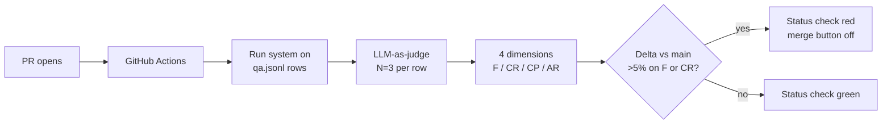

# Building a RAG eval harness from scratch — flat-file qa.jsonl

> [!NOTE]
> **From the overview:** today's harness is what *measures* whether a PR still holds the Thursday HITL #2 gate (faithfulness ≥ 0.85 AND relevance ≥ 0.85). PR #47 wins 30% latency but may have broken it — the harness settles it with evidence.

## The eval pipeline



The QA row carries enough metadata to grade retrieval *and* generation independently. Five fields are the minimum useful row:

| Field | Purpose |
|---|---|
| `query` | Input string as a user would send it |
| `ground_truth_answer` | Canonical answer a domain expert would accept |
| `expected_chunks` | Chunk IDs that *should* be retrieved (recall denominator) |
| `corpus_sources_expected` | Which corpora must contribute (catches cross-corpus misfires) |
| `metadata` | Provenance — source URL/ticket-ID, curator, date added |

Richer rows add `difficulty`, `failure_modes_targeted` (e.g., `cross-corpus-precedence`, `tenant-isolation`), and curator `notes`. Richer metadata = sliceable scoreboard later.

## Today's seed: 20-30 curated rows

Real federal-acq sources only. **Curation rule: never fabricate.** Fabricated rows encode the curator's (or model's) existing biases and the harness becomes a self-fulfilling prophecy.

| Source | Coverage |
|---|---|
| Tue's `test_tenant_boundary.py` (Item 10 pin-test) | Stays as pin; harness adds the dimensional measure on top |
| Thu's 1-row FAR 47.305-2 wrong-chunk fixture | Stays as pin; same logic |
| 15+ rows from FedBizOpps Q&A logs / SBA archives / GAO bid-protest decisions via `/web-research` | Real evidence with source URLs in row metadata |

Rows without provenance go to `qa-unverified.jsonl` and **do not gate merges**. Verified rows gate.

> [!WARNING]
> **Anti-pattern: 5-row tutorial harness.** Internet "RAG eval in 90 min" demos repeatedly ship 5-10 row sets and pick a regression threshold against them. Per the `eval-tiny-sample-set` pattern: thresholds against fewer than ~30 rows sit *inside* the per-row noise floor (~2-3% in practice). A "5% regression" on a 5-row set means one row flipped — it teaches nothing. Today's seed is 20-30 rows; the set grows to 50+ before thresholds become defensible. Sources advocating tiny-set thresholds are flagged for instructor review.

## When to graduate to hosted

Flat-file is right until at least one of: QA set >500 rows, >3 contributors editing concurrently, or eval needs to run against production traffic samples. Below all three, JSONL-in-repo wins — every row's history is in `git log`, every addition is a reviewable PR, the dataset is the same code-review surface as the system it grades. **LangSmith deferred to W5 per D-031.**

## Self-check

> [!NOTE]
> **Self-check** (30s)
>
> 1. Why does `expected_chunks` belong in the row even though the `ground_truth_answer` is also there?
> 2. Why does the unverified-row split (`qa-unverified.jsonl` separate from gating set) matter, and what does "fabricated rows are a self-fulfilling prophecy" mean?

<details>
<summary>Show answers</summary>

1. Because retrieval and generation fail for different reasons and need different fixes. `expected_chunks` lets you score context recall (did we retrieve the right chunks?) independently of faithfulness (did the model stay on-source?). Without it, a system that generates the right answer from the wrong chunks scores high overall and the retrieval bug stays hidden — exactly the wrong-chunk failure mode Thu's HITL #2 was wired to catch.
2. Unverified rows let you capture candidate rows fast (during war-room) without polluting the gating signal. "Self-fulfilling prophecy" means: when the curator (often the model) fabricates a row, the row reflects the model's existing biases — the model will score well on it because the row was generated to match what the model already does. The harness then reports green while real users hit failures.

</details>

<details>
<summary>Generic Python runner — boring on purpose</summary>

```python
# tests/eval/run_eval.py
import json
from pathlib import Path
from system_under_test import answer_query  # the RAG pipeline being graded

DATASET = Path("tests/eval/qa.jsonl")
RESULTS = Path("tests/eval/results.jsonl")

def load_rows(path):
    with path.open() as f:
        for line in f:
            line = line.strip()
            if line and not line.startswith("#"):
                yield json.loads(line)

def grade_retrieval(retrieved_chunks, expected_chunks):
    """Recall + precision on chunk IDs — deterministic, fast."""
    retrieved_ids = {c["id"] for c in retrieved_chunks}
    expected_ids = set(expected_chunks)
    if not expected_ids:
        return {"recall": None, "precision": None}
    recall = len(retrieved_ids & expected_ids) / len(expected_ids)
    precision = (len(retrieved_ids & expected_ids) / len(retrieved_ids)) if retrieved_ids else 0.0
    return {"recall": recall, "precision": precision}

def main():
    with RESULTS.open("w") as out:
        for row in load_rows(DATASET):
            response = answer_query(row["query"])
            retrieval_scores = grade_retrieval(response.retrieved_chunks, row["expected_chunks"])
            out.write(json.dumps({
                "row_id": row.get("id"),
                "query": row["query"],
                "answer": response.answer,
                "retrieval": retrieval_scores,
                # LLM-as-judge layer lives in tests/eval/judge.py (topic 3)
            }) + "\n")

if __name__ == "__main__":
    main()
```

Plain Python composition. No `Chain` subclass. No LCEL `|` pipe. No `chain.run()`. Per D-033 + `known-bad-patterns.yml` IDs `langchain-chain-class`, `langchain-lcel-pipe`, `langchain-chaining-verb`.

</details>

<details>
<summary>Growth strategy + cross-industry patterns</summary>

QA set grows by three signals (always with curator review):

- Production failure surfaced by a user → triage → if failure mode not represented, add a row.
- Near-miss caught by a sibling check (pin-test, smoke test) → if generalisable, add a dimensional row.
- New corpus or new document type arriving → at least one row per new class.

**Compounding effect:** a 50-row harness from week one growing to 250 over a quarter — every row earned by real evidence — outperforms a 500-row synthetic harness shipped on day one.

Cross-industry: fintech chargeback assistant moved recall 0.526 → 0.738 by iterating chunking against a harness curated from historical disputes; healthcare medication-safety triage exposed a 13.3% high-risk-vs-low-risk gap a single aggregate score would have hidden; e-commerce kept JSONL as authoring surface even after moving to a hosted platform (platform = dashboard, JSONL = source of truth).

</details>

<details>
<summary>Sources (retrieved via /web-research per D-046)</summary>

1. RAG Evaluation Harnesses — RulinShao GitHub: <https://github.com/RulinShao/RAG-evaluation-harnesses> — 2026-05-26
2. Prem AI — RAG Evaluation 2026: <https://blog.premai.io/rag-evaluation-metrics-frameworks-testing-2026/> — 2026-05-26
3. RAGAS metrics overview: <https://docs.ragas.io/en/latest/concepts/metrics/> — 2026-05-26
4. Maxim — Best RAG Evaluation Tools 2026: <https://www.getmaxim.ai/articles/the-5-best-rag-evaluation-tools-you-should-know-in-2026/> — 2026-05-26
5. Financial RAG — chunking to 90% recall: <https://medium.com/@steveinatorx_49018/building-a-financial-rag-system-pt-5-how-i-fixed-chunking-to-reach-90-recall-7f1158e934a9> — 2026-05-26
6. PMC 12629785 — clinical LLM benchmark: <https://www.ncbi.nlm.nih.gov/pmc/articles/PMC12629785/> — 2026-05-26

</details>

Last verified: 2026-06-03
