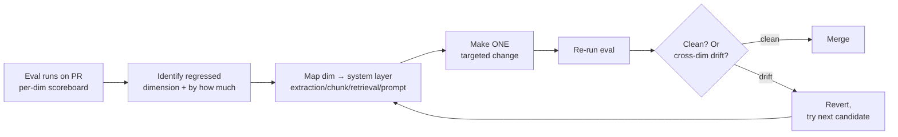

# Iterative improvement loops — eval → fix → re-eval

> [!NOTE]
> **From topic 4:** PR #47's harness says faithfulness -6%, context recall -17%. The PR does not merge. This topic is the loop discipline that turns that signal into a follow-up fix Monday, not three rounds of guessing.

## 1. Learning Objectives

- Map a regressed dimension to its most likely system layer using the metric-to-layer table.
- Identify cross-dimension drift and walk back fixes that move dimension X at the cost of dimension Y.
- Order fixes by layer leverage — extraction > chunking > retrieval > generation.
- Defend "one variable at a time" against the temptation to compound fixes in a single PR.

## 2. Introduction

A red harness signal is the start of the loop, not the end. Without discipline, teams iterate fixes against the harness, scores improve on the curated 20 rows, and they ship — only to find the improvements generalised to the rows and nowhere else. The loop discipline: change one variable, re-eval, watch for cross-dimension drift, accept the win only if no dimension regressed below the noise floor. PR #47's regression dominates on context recall (-17%) — that points to chunking. Monday's candidate fix is parent-child indexing, not "let me tweak the prompt and see if it helps."

## 3. Core Concepts

### 3.1 The loop



### 3.2 Metric → layer mapping

| Regressed dimension | Most likely layer | First candidate fix |
|---|---|---|
| **Faithfulness** | Prompt grounding loosened OR retrieval pulled wrong chunks | Tighten grounding instruction OR rerank top-K to push relevant higher |
| **Context recall** | Chunking too aggressive (splits answers across chunks) OR retrieval mode | Parent-child indexing OR add sparse/BM25 leg OR top-K increase |
| **Context precision** | Reranker noise — too many irrelevant chunks pulled | Cross-encoder rerank top-50 → top-5 OR top-K decrease OR query rewrite |
| **Answer relevance** | Almost always prompt — model answering slightly different question | Clarify what the prompt asks; add "if ambiguous, ask clarifier" instruction |

Pattern: relevance lives in the prompt; recall lives in chunking + retrieval mode; precision lives in the reranker; faithfulness sits between prompt and retrieval and needs both right.

### 3.3 Cross-dimension drift — the trap

Fixing dimension X often regresses dimension Y:

| Fix | Unintended regression |
|---|---|
| Tighten grounding prompt → faithfulness up | Model refuses partial-valid answers → answer relevance drops |
| Smaller chunks → context precision up | Truncates evidence → faithfulness drops |
| Add BM25 leg → context recall up | Keyword noise → context precision drops |
| Increase top-K → context recall up | More distraction → answer relevance drops |

This is why the harness reports **all four dimensions** even when only two block. Non-blocking dimensions are the early-warning system for cross-dimension drift. A PR that improves faithfulness 8% but silently degrades answer relevance 4% is not a win — it's a shape-shift; the system is rotating to a different shape than the team thinks they're running.

### 3.4 Layered fix order — highest-leverage first

When several layers could plausibly fix a regression:

1. **Document extraction** — is the source clean? OCR errors? table-extraction failures? Bad data poisons every layer downstream.
2. **Chunking** — parent-child? overlap? section-aware boundaries?
3. **Retrieval** — dense? sparse? hybrid? reranker depth?
4. **Generation** — prompt? model? few-shot examples?

Fixing the prompt over garbled chunks wastes effort — the prompt cannot rescue bad data. Extraction is often the highest-leverage change in early-stage systems because every downstream layer compounds on clean data.

> [!IMPORTANT]
> **One variable at a time.** A PR that bundles "chunking change + reranker change + prompt change" cannot be diagnosed when something drifts. The harness reports drift; the PR can't isolate which change caused it. Each layer change gets its own PR with its own harness run — even at the cost of merge velocity. Velocity bought by bundling is paid back in postmortem hours.

## 4. Generic Implementation

```python
# PR #47 diagnosis sketch — one variable at a time
# Lives in acquire-gov at docs/adr/0007-pr47-recall-regression.md (commits Monday)
"""
Regression: faithfulness -6.5%, context recall -16.7% on PR #47.

Hypothesis 1 (highest leverage — chunking layer):
    Per-row diff shows regressed rows share a structural pattern: multi-clause
    queries where the answer spans two FAR/DFARS sections. 512-token sliding
    window from PR #47 split DFARS 215.371-4 across two chunks; first ranks
    high, second (with timing exception) misses → recall drops.

Candidate fix:
    Parent-child indexing — 384-token children for retrieval (precision win
    from PR #47 stays), 1024-token parents to the LLM (recover recall).

Predicted score movement:
    - Context recall:  recovers toward baseline.
    - Context precision: dips slightly from larger parents.
    - Faithfulness: stays improved (more context per chunk).
    - Answer relevance: unchanged (prompt didn't move).

If hypothesis 1 doesn't land, candidate 2 hits a DIFFERENT layer
(reranker change OR embedding model swap), not another chunk-size tweak
in the same layer.
"""
```

The shape of the ADR is the discipline: hypothesis + predicted movement + revert criteria. If the prediction misses by more than the noise floor on any dimension, revert and try a different layer — don't iterate within the same layer until "it works."

## 5. Real-world Patterns

**Healthcare — drug-interaction lookup.** A clinical assistant switched sentence→paragraph chunking; precision up but recall down on multi-drug queries (interactions for a 4-drug combo span paragraphs). Moved to parent-child indexing; recovered recall without losing precision. The cross-dimension trap was visible only because the harness reported all four dimensions.

**E-commerce — product-spec Q&A.** Tightened grounding prompt; answer relevance dropped 5% (model refused partial-spec answers). Walked back the prompt change, invested in better PDF spec-table extraction instead — faithfulness improved without relevance regression. Highest-leverage fix turned out to be one layer up from the symptom.

**Logistics — customs classification.** Added BM25 leg for rare codes; recall up, precision noise. Added a reranker to cull BM25 noise; final pipeline outperformed dense-only on both dimensions. Layered fixes work when the second addresses the regression caused by the first — but each is its own PR.

**Fintech — earnings-call assistant.** Harness flagged faithfulness regression after prompt tightening. Team's instinct: loosen the prompt. Actual cause: an embedding-model swap from two PRs back subtly favoured numerical chunks over narrative — surfaced by per-row diff, not aggregate. Looking at regressed rows caught the real culprit.

## 6. Best Practices

- **One variable at a time per PR** — bundling kills diagnosability.
- **Map dim → layer with the table** — don't tweak prompt for a recall regression.
- **Look at regressed rows, not just aggregate** — per-row diff surfaces the real layer.
- **Predict score movement before re-eval** — predictions force model-of-the-system thinking.
- **Revert on cross-dim regression past noise floor** — "right direction overall" is how systems drift.
- **Fix extraction > chunking > retrieval > generation** — highest leverage first.
- **Commit the ADR with the fix** — future you re-reads it when the regression recurs.

> [!CAUTION]
> **Anti-pattern: over-fitting the harness to a tiny QA set.** Per `eval-tiny-sample-set` — with fewer than ~50 rows (especially fewer than ~30 adversarial rows), per-row noise dominates the regression signal. Teams iterate fixes against the harness, scores improve, and they ship — only to find the "improvements" only generalised to the curated 20 rows. The harness is now *trained*, not measuring. **Calibrate against 50+ adversarial rows before treating thresholds as defensible.** Today's 20-30 row seed is V1; the cohort grows it through Phase 1.

## 7. Hands-on Exercise

Diagnose PR #47 before war-room block D: (a) load per-row scores from `tests/eval/results.jsonl` and the main baseline; (b) sort rows by recall delta; (c) identify the structural pattern in regressed rows (multi-clause queries? specific FAR/DFARS sections?); (d) name the responsible layer and first candidate fix; (e) predict score movement across all four dimensions. Bring the ADR sketch to war-room — the team commits it Monday after §0 retro.

> [!NOTE]
> **Self-check** (30s)
>
> 1. The harness reports faithfulness +3%, context recall -8%, context precision +6%, answer relevance unchanged after a chunk-size cut (768 → 384). What's the root cause and what's your first candidate fix?
> 2. Why is "revert when a fix introduces cross-dimension regression" the most-skipped discipline?

<details>
<summary>Show answers</summary>

1. Section-spanning-answer problem — chunks now too small to hold a full answer in one chunk. First candidate: parent-child indexing with 384-token children (preserve the precision gain) + 1024-token parents to the LLM (recover recall). Prediction: recall recovers, precision may dip slightly from the larger parents, faithfulness stays improved (more context), relevance unchanged (prompt didn't move). If the first candidate doesn't land, the second should hit a *different* layer (e.g., reranker change, embedding model swap) — not just another chunk-size tweak in the same layer.
2. Because the score *moved in the right direction* and shipping is on the table. The reviewer sees faithfulness up, the regression on relevance feels acceptable, and the trade-off becomes "we got a win, it's fine." Six weeks later that pattern compounds — every PR ships a 1-2% drift somewhere — and the system has silently rotated to a different shape than the one the team thought they were running. Revert when the cross-dim regression exceeds the noise floor; ship only when you can defend the trade-off in the PR description.

</details>

## 8. Key Takeaways

- Eval signal → metric-to-layer mapping → one variable → re-eval → ship or revert.
- F = prompt/retrieval; recall = chunking/mode; precision = reranker; relevance = prompt.
- All four dimensions reported — non-blocking ones are the cross-drift early-warning.
- Layered leverage: extraction > chunking > retrieval > generation.
- ADR-with-prediction prevents three rounds of guessing.

## 9. Sources

<details>
<summary>References — retrieved via /web-research per D-046</summary>

- <https://www.lancedb.com/blog/rag-isnt-one-size-fits-all> — retrieved 2026-05-26 — hot-tech-3mo
- <https://datavlab.ai/post/rag-evaluation-methods-metrics-2026-guide> — retrieved 2026-05-26
- <https://www.firecrawl.dev/blog/best-chunking-strategies-rag> — retrieved 2026-05-26
- <https://neo4j.com/blog/genai/advanced-rag-techniques/> — retrieved 2026-05-26
- <https://ragflow.io/docs/configure_child_chunking_strategy> — retrieved 2026-05-26

</details>

<details>
<summary>Deeper dive — parent-child indexing + cross-industry loops</summary>

**Parent-child indexing — why it shows up so often.** Pattern: index small chunks (256 tokens) for retrieval (semantic-similarity matches well on focused content) but pass larger parent chunks (1024 tokens — the section the child lives in) to the LLM for generation. Smaller chunks find the right neighborhood; larger parents give the model enough context to actually answer. Modern vector stores (RAGFlow 0.23+, Atlas, several others) ship this as a first-class pattern. Documented to move recall from ~0.53 to ~0.74 in financial RAG systems by avoiding the trap where a regulatory provision spans two sub-paragraph chunks.

**Why parent-child beats overlap windows:** sliding-window overlap (e.g., 512-token windows with 128-token overlap) tries to solve the same span-boundary problem but doubles index size and introduces ranking noise (the same content shows up twice in the candidate pool). Parent-child keeps one parent per child; the retrieval surface is the child, the LLM input is the parent, no duplication.

**Cross-industry loops:**

- **Healthcare drug-interaction lookup.** Switched sentence→paragraph chunking, precision up but recall down on multi-drug queries (interactions for a 4-drug combo span paragraphs). Moved to parent-child; recovered recall without losing precision.
- **E-commerce product-spec Q&A.** Tightened grounding prompt to reduce spec-question hallucinations; answer relevance dropped 5% (model refused partial-spec answers). Walked back the prompt change, invested in better PDF spec-table extraction instead — faithfulness improved without relevance regression.
- **Logistics customs classification.** Added BM25 leg for rare commodity codes; recall up, precision noise. Added a reranker on top to cull BM25 noise; final pipeline outperformed dense-only on both dimensions.

**Per-row diff discipline:** the aggregate metric tells you *something* changed; the per-row diff tells you *what*. Sort rows by per-dimension delta; the top-5 regressed rows usually share a structural pattern (specific query type, specific corpus, specific document version). The pattern names the layer faster than aggregate-only inspection.

**Predicted-vs-actual movement:** record the prediction in the ADR before re-eval. If the prediction misses by more than the noise floor on any dimension, the model-of-the-system was wrong — that's higher-priority signal than the regression itself. Mismatch between predicted and actual is how you debug your *own understanding* of the pipeline.

</details>

Last verified: 2026-06-03
