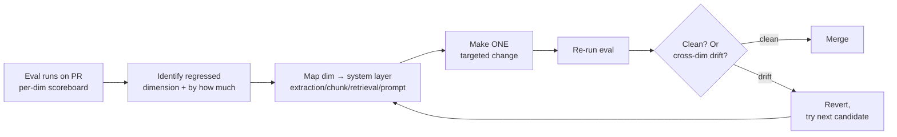

# Iterative improvement loops — eval → fix → re-eval

> [!NOTE]
> **From topic 4:** PR #47's harness says faithfulness -6%, context recall -17%. The PR does not merge. This topic is the loop discipline that turns that signal into a follow-up fix Monday, not three rounds of guessing.

## The loop

## Metric → layer mapping

| Regressed dimension | Most likely layer | First candidate fix |
|---|---|---|
| **Faithfulness** | Prompt grounding loosened OR retrieval pulled wrong chunks | Tighten grounding instruction OR rerank top-K to push relevant higher |
| **Context recall** | Chunking too aggressive (splits answers across chunks) OR retrieval mode | Parent-child indexing OR add sparse/BM25 leg OR top-K increase |
| **Context precision** | Reranker noise — too many irrelevant chunks pulled | Cross-encoder rerank top-50 → top-5 OR top-K decrease OR query rewrite |
| **Answer relevance** | Almost always prompt — model answering slightly different question | Clarify what the prompt asks; add "if ambiguous, ask clarifier" instruction |

Pattern: relevance lives in the prompt; recall lives in chunking + retrieval mode; precision lives in the reranker; faithfulness sits between prompt and retrieval and needs both right.

## Cross-dimension drift — the trap

Fixing dimension X often regresses dimension Y:

| Fix | Unintended regression |
|---|---|
| Tighten grounding prompt → faithfulness up | Model refuses partial-valid answers → answer relevance drops |
| Smaller chunks → context precision up | Truncates evidence → faithfulness drops |
| Add BM25 leg → context recall up | Keyword noise → context precision drops |
| Increase top-K → context recall up | More distraction → answer relevance drops |

This is why the harness reports **all four dimensions** even when only two block. Non-blocking dimensions are the early-warning system for cross-dimension drift.

> [!CAUTION]
> **Anti-pattern: over-fitting the harness to a tiny QA set.** Per `eval-tiny-sample-set` blocklist — with fewer than ~50 rows (especially fewer than ~30 adversarial rows), per-row noise dominates the regression signal. Teams iterate fixes against the harness, scores improve, and they ship — only to find the "improvements" only generalised to the curated 20 rows. The harness is now trained, not measuring. **Calibrate against 50+ adversarial rows before treating thresholds as defensible.** Today's 20-30 row seed is V1; the cohort grows it through Phase 1.

## Layered fix order — highest-leverage first

When several layers could plausibly fix a regression:

1. **Document extraction** — is the source clean? OCR errors? table-extraction failures? Bad data poisons every layer downstream.
2. **Chunking** — parent-child? overlap? section-aware boundaries?
3. **Retrieval** — dense? sparse? hybrid? reranker depth?
4. **Generation** — prompt? model? few-shot examples?

Fixing the prompt over garbled chunks wastes effort — the prompt cannot rescue bad data. Fixing extraction is often the highest-leverage change in early-stage systems because every downstream layer compounds on clean data.

## PR #47 expected diagnosis

- Regression dominates on **context recall** (-17%).
- Per-row diff: regressed rows share a structural pattern — multi-clause queries where the answer spans two FAR/DFARS sections.
- Hypothesis: 512-token sliding window split DFARS 215.371-4 across two chunks; first ranks high, second (with timing exception) misses.
- **Candidate fix (Mon):** parent-child indexing — 384-token children for retrieval, 1024-token parents to the LLM. Recall should recover; precision may dip slightly; faithfulness should improve; relevance unchanged.

## Self-check

> [!NOTE]
> **Self-check** (30s)
>
> 1. The harness reports faithfulness +3%, context recall -8%, context precision +6%, answer relevance unchanged after a chunk-size cut (768 → 384). What's the root cause and what's your first candidate fix?
> 2. Why is "revert when a fix introduces cross-dimension regression" the most-skipped discipline?

Show answers

1. Section-spanning-answer problem — chunks now too small to hold a full answer in one chunk. First candidate: parent-child indexing with 384-token children (preserve the precision gain) + 1024-token parents to the LLM (recover recall). Prediction: recall recovers, precision may dip slightly from the larger parents, faithfulness stays improved (more context), relevance unchanged (prompt didn't move). If the first candidate doesn't land, the second should hit a *different* layer (e.g., reranker change, embedding model swap) — not just another chunk-size tweak in the same layer.
2. Because the score *moved in the right direction* and shipping is on the table. The reviewer sees faithfulness up, the regression on relevance feels acceptable, and the trade-off becomes "we got a win, it's fine." Six weeks later that pattern compounds — every PR ships a 1-2% drift somewhere — and the system has silently rotated to a different shape than the one the team thought they were running. Revert when the cross-dim regression exceeds the noise floor; ship only when you can defend the trade-off in the PR description.

Parent-child indexing — why it shows up so often

Pattern: index small chunks (256 tokens) for retrieval (semantic-similarity matches well on focused content) but pass larger parent chunks (1024 tokens — the section the child lives in) to the LLM for generation. Smaller chunks find the right neighborhood; larger parents give the model enough context to actually answer. Modern vector stores (RAGFlow 0.23+, Atlas, several others) ship this as a first-class pattern. Documented to move recall from ~0.53 to ~0.74 in financial RAG systems by avoiding the trap where a regulatory provision spans two sub-paragraph chunks.

Cross-industry — three loops

- **Healthcare drug-interaction lookup.** Switched sentence→paragraph chunking, precision up but recall down on multi-drug queries (interactions for a 4-drug combo span paragraphs). Moved to parent-child; recovered recall without losing precision.
- **E-commerce product-spec Q&A.** Tightened grounding prompt to reduce spec-question hallucinations; answer relevance dropped 5% (model refused partial-spec answers). Walked back the prompt change, invested in better PDF spec-table extraction instead — faithfulness improved without relevance regression.
- **Logistics customs classification.** Added BM25 leg for rare commodity codes; recall up, precision noise. Added a reranker on top to cull BM25 noise; final pipeline outperformed dense-only on both dimensions.

Sources (retrieved via /web-research per D-046)

1. LanceDB — RAG Isn't One-Size-Fits-All: <https://www.lancedb.com/blog/rag-isnt-one-size-fits-all> — 2026-05-26
2. DataVLab — RAG Evaluation 2026: <https://datavlab.ai/post/rag-evaluation-methods-metrics-2026-guide> — 2026-05-26
3. Firecrawl — Best Chunking Strategies for RAG: <https://www.firecrawl.dev/blog/best-chunking-strategies-rag> — 2026-05-26
4. Neo4j — Advanced RAG Techniques: <https://neo4j.com/blog/genai/advanced-rag-techniques/> — 2026-05-26
5. RAGFlow — Child chunking strategy: <https://ragflow.io/docs/configure_child_chunking_strategy> — 2026-05-26

Last verified: 2026-06-03
