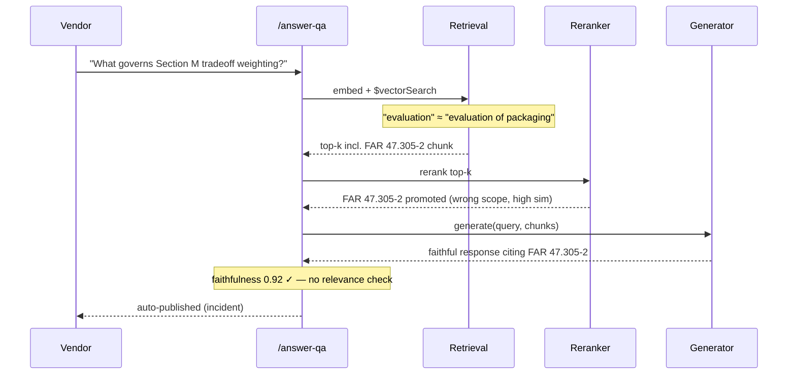

# W2 D4 Thu War-Room — What you're tackling today

> **Mode: Incident. THIS IS WHERE HITL #2 LANDS** — 2nd of 7 programme HITL touchpoints (D-043/D-044). Pre-session named the failure-mode taxonomy. Today you wire the `needs_human_review` envelope on `POST /answer-qa` + CO review queue + faithfulness-threshold gate. By 12:00 the platform stops auto-publishing unreviewed answers.

## What we're tackling today + why

The SSA forwarded the CO a Q&A response the platform auto-published yesterday afternoon. Vendor asked about Section M evaluation factors for a cloud-modernization solicitation. The platform cited **FAR 47.305-2** as governing tradeoff weighting. FAR 47.305-2 is about **transportation packaging**.

Embedding-model misfire: "evaluation" in the query embedded near "evaluation of packaging" in the FAR 47 chunk. Reranker promoted it. LLM composed a response faithful to the wrong chunk. The check that would have caught it — **relevance** (chunks → query scope) — doesn't exist yet.

> [!IMPORTANT]
> The SSA wants HITL on `POST /answer-qa` by EOD or she pulls the platform out of the pilot. Envelope ships first (escape hatch before the underlying retrieval fix). Both judges (faithfulness + relevance) at 0.85. Real Bedrock `InvokeModel` per D-060 — no mocks.

> [!WARNING]
> **Source contradiction — RAGAS faithfulness-only.** Most internet RAG tutorials present RAGAS `faithfulness` as the sole runtime gate. Yesterday's incident is exactly the shape that misses: ~0.92 faithfulness, ~0.6 relevance. Wire **both** axes at 0.85 today; Fri's harness will tune them on real data. Per `known-bad-patterns.yml` `ragas-faithfulness-only`.

You're wiring the envelope pattern first, then the LLM-as-judge faithfulness+relevance check at threshold 0.85 (Fri's eval harness will give you data to tune), then the CO review queue with 4-hour business-hours SLA. Same day you also ship the **Item 5 legacy chain migration** — `LLMChain.run()` out of Drafting Wizard + Amendment Editor + notification-copy generator per D-033 LangChain v1.0 posture.

> [!CAUTION]
> Codex Adversarial Review is at **Ramping** strictness (D-034) — any PR re-introducing `LLMChain.run()` or LCEL `|` pipes after today is **blocked**, not coached. Sweep your pair-domain code too — same rule applies to grants / FOIA / post-award PRs.

## What to know walking in

- `pre-session/4-Thursday/1-DailyTopicOverview.md` read — the three RAG failure modes + the HITL #2 envelope.
- Yesterday's multi-tenant fix is live. Atlas index has `agency_id` pre-filter. Today is unrelated to Item 10.
- **Faithfulness** = response matches retrieved chunks. **Relevance** = chunks match the query's expected scope. Yesterday had high faithfulness AND low relevance. You need both.
- LLM-as-judge candidate = **Claude Haiku 4.5** on Bedrock (cheap, fast, real `InvokeModel` per D-060).
- Item 5 migration ships same PR or paired PR — no more `LLMChain.run()` after today.
- Pair-Project teams also wire HITL #2 to their pair-domain Q&A endpoint (grants / FOIA / post-award) PM.
- Drafter endpoints (`/draft-solicitation`, `/draft-amendment`) do NOT need the envelope — implicitly HITL-gated by CS workflow. HITL #2 scopes to the auto-publish path on `/answer-qa`.

## EOD deliverable (Thu EOD)

Four tickets land:

1. **`feat(ai-orch)`** — HITL #2 envelope on `POST /answer-qa`: `needs_human_review` status + faithfulness/relevance LLM-as-judge gate at threshold 0.85.
2. **`feat(sol-svc)`** — CO review queue endpoint + minimal CS UI (review list, approve, edit-and-approve, reject-with-redraft).
3. **`refactor(ai-orch)`** — migrate `legacy_chain.py`: Drafting Wizard + Amendment Editor + notification-copy generator off `LLMChain.run()` to plain Python composition (D-033).
4. **`test(rag-eval)`** — yesterday's failing query (Section M → FAR 47.305-2) added to `qa.jsonl` as regression fixture. Two fixtures now (Wed's cross-tenant + today's wrong-chunk) — Fri builds the full harness around them.

By 17:00 the SSA can verify: no auto-publish without faithfulness ≥ 0.85; review queue exists; yesterday's failing query is a regression test; audit log shows both auto-drafts and CO-reviewed states.

Reference

- W2 PLAN: `weeks/W02/PLAN.md`
- Pre-read (Thu): `pre-session/4-Thursday/1-DailyTopicOverview.md` + topics 2–6
- HITL programme thread (7 touchpoints): W1 Fri, **W2 Thu = today**, W3 Mon, W3 Wed, W3 Thu, W4 Wed, W5 Wed
- Tomorrow's prep: `pre-session/5-Friday/1-DailyTopicOverview.md` — Fri AM eval-harness build, Fri PM **first Live Defense + first standard two-tier MCQ**.

