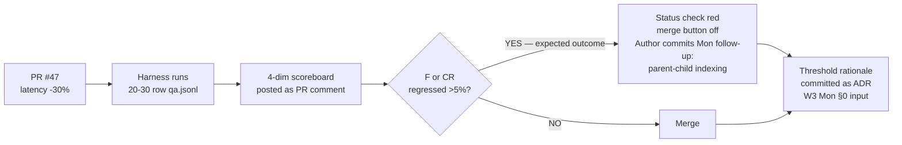

# W2 D5 Fri War-Room — What you're tackling today

> **Mode: Incident → Eval-driven framing.** You build the RAG eval harness from scratch this morning, run it against PR #47, and answer "do we ship?" with evidence not vibes. Afternoon: **Live Defense (first of the programme) 14:00 + W2 standard two-tier MCQ 16:30**.

## What we're tackling today + why

One pair opened PR #47 last night with a chunking-strategy tweak — sub-paragraph chunks → 512-token sliding window, 20% overlap. Latency on `POST /rag/clause-search` dropped 30% (770ms → 540ms p95). CO is happy. But the cohort has no eval harness, so "is it still grounded?" is a vibe answer. Two cohort members say "feels worse" on the FAR 15.208(a) / DFARS 215.371-4 timing question (Tue's vendor scenario) — the 512-token window splits DFARS 215.371-4 and the timing exception now misses retrieval. Two say "feels fine." Today you settle it with evidence.

By 12:00: 4-dimension RAGAS harness (faithfulness, context recall, context precision, answer relevance) running in CI with LLM-as-judge (Claude Haiku on Bedrock). PR #47 ships if clean; blocks if >5% regression on faithfulness or context recall.

## The ship-gate decision flow

> [!IMPORTANT]
> **Block-or-ship is committed in writing on PR #47 with the harness output as the evidence.** Expected outcome: does not merge (context recall regressed ~14% on dual-corpus citations). Author pair commits to a follow-up PR Monday with parent-child indexing + restored sub-paragraph chunking. W3 Mon §0 retro evaluates whether the follow-up lands. **No verbal ship decisions today — everything is on the PR.**

This is also the **first piece of CI in the repo** — partial close of debt Item 12 (the broader GHA lint stays disabled until W4 modernization). The cohort opens an OIG-style finding via `POST /api/findings` against the acquire-gov repo for the remaining debt. First instance of the platform managing its own technical debt as findings.

## What to know walking in

- Overview read — 4 RAGAS dimensions + LLM-as-judge calibration.
- 2 existing fixtures in `tests/rag-eval/` from this week — Wed's cross-tenant leak + Thu's FAR 47.305-2 → Section M wrong-chunk. Both pass on PR #47 (pin-tests, not RAGAS-style).
- Instructor pre-scored 5 QA rows Wed PM — calibrate the judge against those before running the full set. **Refuse to ship a judge prompt with mean disagreement > 0.1.**
- 20-30 row held-out QA set by 11:00. Curate from Tue + Thu fixtures + 15+ via `/web-research` from real federal-acq archives. **Never fabricate.**
- LLM-as-judge non-deterministic — N=3 with seeded sampling, mean + stddev. Stddev > 0.05 on any dim = tighten the rubric.
- Codex Adversarial Review (Ramping per D-034) on every Fri PR. P1 findings block. Harness PR + Thu `legacy_chain.py` migration PR + cleanup PRs all run through it.
- **Afternoon is graded.** Each pair pre-selects one defender for Live Defense (10 min each, from `W02-SA-1/2/3`). MCQ 16:30 first standard two-tier (different from W1 Light).

> [!WARNING]
> **RAGAS faithfulness-only is the day's biggest trap.** Tutorials commonly show one-dimension grading; the cohort wires **all four** dimensions. PR #47's expected failure is on **context recall**, not faithfulness — a faithfulness-only harness would have green-lit the merge and shipped the broken DFARS retrieval. The Live Defense rubric (14:00) probes this explicitly if any pair argues otherwise. Same anti-pattern Thu's HITL #2 was wired against (`ragas-faithfulness-only` blocklist).

## EOD deliverable (Fri EOD)

**Morning (by 12:00):**

1. **Eval harness running in CI on PR #47** — 4-dimension scoreboard PR comment + status check that blocks merge if >5% faithfulness or context-recall regression.
2. **PR #47 ship/no-ship decision** — committed in writing on the PR with the harness output as evidence.
3. **20-30 row held-out QA set** committed at `ai-orchestrator/tests/rag-eval/qa.jsonl`.
4. **OIG-style finding opened** via `POST /api/findings` for debt Item 12 (broader GHA lint workflow still disabled). Cohort's first meta-loop instance.

**Afternoon:**

- 14:00 Live Defense — first of the programme. One defender per pair, 10 min each, instructor scores against `templates/live-defense-rubric.md`.
- 16:30 W2 MCQ — standard two-tier, ~30 min duration.
- EOD weekly retros (3 pair + 1 cohort) per `templates/weekly-retro.md`. **Don't bury negative signals** — Mon W3's §0 retro is the first formal Plan-spec retrospective and these are its inputs.

## Reference

- W2 PLAN: `weeks/W02/PLAN.md`
- RAGAS metrics (4 dimensions): source linked from `pre-session/5-Friday/1-DailyTopicOverview.md`
- LLM-as-judge calibration pattern: source linked from `pre-session/5-Friday/3-llm-as-judge-for-retrieval-eval.md`
- Bedrock Claude Haiku model card (judge candidate): source linked from `pre-session/5-Friday/1-DailyTopicOverview.md`
- Live Defense rubric: `templates/live-defense-rubric.md`
- W2 MCQ scope: `weeks/W02/assessments/W02-MCQ.md`
- Codex Ramping strictness rules (D-034): `pipeline/DECISIONS.md`
- Tomorrow / Mon prep: `pre-session/5-Friday/7-w3-mon-plan-day-preview-and-live-defense-expectations.md` — agentic systems (first multi-agent + LangGraph HITL week). W3 Mon §0 retro evaluates this week's plan-spec.
