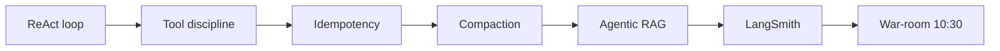

# W03 Tuesday Pre-Session — Single-Agent + Tool-Calling

> [!NOTE]
> **From earlier:** Mon's agentic ADR named the HITL #3 boundary and committed the architecture. Today you wire the actual agent.

## 1. What you'll learn today

By the end of war-room you'll be able to:

- Trace all three phases of a ReAct loop (Reason → Act → Observe) and identify the termination signal
- Define the Bedrock `tool_use` / `tool_result` exchange and author a Pydantic-generated `input_schema`
- Explain why LangGraph checkpoint/resume makes idempotency a correctness requirement, not a hygiene preference
- Describe two in-context compaction strategies (summarize-on-overflow, selective retention) and when each applies
- Distinguish four agentic-RAG patterns and map them to a cost ladder
- Wire LangSmith tracing with three env vars and attach per-call metadata

## 2. The day at a glance

| Topic | Focus | Reading min | Why you need it today |
|-------|-------|------------:|-----------------------|
| 2. ReAct loop | Reason + Act + Observe, termination, budgets | ~12 | The loop the intake-triage endpoint runs |
| 3. Tool-calling discipline | Bedrock `tool_use` API, Pydantic schemas | ~12 | Five tools = five schemas before war-room |
| 4. Idempotency | Unique-constraint, conditional insert, Redis | ~12 | `route_to_evaluators` must be safe on replay |
| 5. In-context memory + compaction | Summarize-on-overflow, selective retention | ~12 | Fed proposals overflow context fast |
| 6. Agentic-RAG patterns | Self-querying, multi-query, fusion, CRAG | ~12 | W2 RAG layer is a tool today |
| 7. LangSmith | Env vars, `@traceable`, metadata | ~12 | Wed's multi-agent debug requires today's traces |

## 3. Threading

- **HITL programme thread:** HITL #3 landed Mon (Plan Day ADR). HITL #4 Wed (multi-agent handoff boundary). Today sits between — tool-wiring day.
- **Phase thread:** Phase 1 (AI Adoption). `POST /agent/intake-triage` is the Phase 1 flagship endpoint.
- **Pair-project:** Each pair wires the equivalent intake flow in their own repo using the same Bedrock tool-use surface.
- **Decision anchors:** D-031 (LangSmith first appearance today), D-033 (LangChain v1.0 posture — no Chain class, no LCEL pipe), D-060 (intake-triage → evaluator → SSA handoff architecture).

## 4. Why today matters

Mon's ADR defined the HITL boundary and committed the agent topology. Today is when that topology becomes running code. The `POST /agent/intake-triage` endpoint in `services/ai-orchestrator` goes from blank to a working single-agent ReAct loop by 17:00.

The sequencing is deliberate. Five tool schemas with strict Pydantic validation — `get_solicitation`, `get_amendments`, `score_completeness`, `route_to_evaluators`, `escalate_to_co` — must be correct before the loop runs. Idempotency keys on both write tools must be in place before LangGraph checkpointing enters the picture on Thu. LangSmith traces must be live today so Wed's multi-agent debugging has history to work from.

> [!IMPORTANT]
> **War-room anchor:** Acme Cloud Services submitted a proposal referencing the old solicitation version. The CO amended yesterday at 16:30. The agent must detect staleness on three verifiable signals — timestamp mismatch, `requires_acknowledgement = true`, no ack row — then decide: route to evaluators or escalate to CO. The decision policy is yours; the detection logic is deterministic, not LLM-parsed.

Getting one agent right today is the prerequisite for five agents behaving correctly on Wed. Discipline before scale.

## 5. How to read this

- Read topics 2–7 in order — each builds on the prior. ReAct loop → tool API shape → idempotency contract → compaction policy → RAG patterns → observability.
- Self-checks at end of each topic — take 30 s before expanding answers.
- Deeper dives are optional but recommended for senior FDEs prepping for the Wed multi-agent complexity jump.
- Hands-on exercises feed directly into war-room at 10:30.
- Total expected time: **~72 min at 100 wpm** (plus this overview).

> [!TIP]
> **Prep cue.** Have your Mon ADR open in a second tab — Tue's hands-on exercises name the same HITL #3 boundary you committed to yesterday. The agent you wire today is the one the ADR described.

> [!CAUTION]
> **Cross-topic watch.** Every topic today has a write-tool equivalent. The discipline from topic 3 (schema), topic 4 (idempotency), and topic 7 (observability) all apply to every write tool. A tool that passes schema validation but lacks an idempotency key is half-correct — Codex Adversarial Review at Near-full strictness will flag it.

## 6. Two questions to walk in with tomorrow

1. Your single-agent intake-triage loop escalated to CO. Wed you'll add a multi-agent evaluator tier above it. What is the single most important structural difference between today's single-agent topology and Wed's supervisor-worker pattern?
2. LangSmith captured today's traces. When Wed's supervisor agent makes a bad delegation, how do you use today's traces as a baseline to isolate whether the failure is in the supervisor or in the worker?

Topic-to-war-room map

- Topic 2 (ReAct loop) → War-room block A (~10 min): walk the ReAct phases on the stale-proposal scenario
- Topic 3 (Tool discipline) → War-room block B (~15 min): wire five tool schemas, validate against Bedrock shape
- Topic 4 (Idempotency) → War-room block C (~10 min): document idempotency keys on both write tools
- Topic 5 (Compaction) → War-room block D (~5 min): set the token-budget threshold for the intake loop
- Topic 6 (Agentic RAG) → War-room block E (~10 min): call `POST /rag/clause-search` as an agent tool
- Topic 7 (LangSmith) → War-room block F (~5 min): verify traces live before writing more code

Consolidated sources

- `research/langchain-v1-20260522.md` — LangChain v1.0 (v1.3.0 latest, 2026-05-12). Retrieved 2026-05-22 via `/web-research`.
- `research/bedrock-claude-catalog-20260522.md` — Bedrock Claude model catalog + InvokeModel tool-use API shape. Retrieved 2026-05-22 via `/web-research`.
- https://docs.smith.langchain.com/observability — LangSmith tracing setup. Retrieved 2026-05-23 via `/web-research`.
- https://langchain-ai.github.io/langgraph/agents/agents/ — LangGraph agent (ReAct) implementation. Retrieved 2026-05-23 via `/web-research`.
- https://docs.aws.amazon.com/bedrock/latest/userguide/tool-use-inference-call.html — Bedrock InvokeModel + Claude tool use. Retrieved 2026-05-22 via `/web-research`.

Last verified: 2026-06-06
