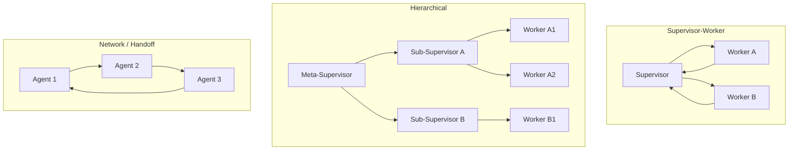

# Wednesday Pre-Session — Multi-agent topologies, HITL #4, KG/CG

> [!NOTE]
> **From earlier:** Mon's ADR named *which* supervisor-to-worker transitions get HITL gates and why. Today HITL #4 lands at that handoff boundary — implementation begins.

## 1. What you'll learn today

By the end of war-room you'll be able to:

- Identify and distinguish the three multi-agent topology shapes: supervisor, hierarchical, network.
- Implement a parallel fan-out with LangGraph's Send API and state reducers.
- Spot chatty handoffs, audit fan-out, and lost-context failure modes in a trace.
- Wire HITL #4 as a soft interrupt at the supervisor → worker delegation point.
- Apply the scaffold orchestrator pattern to keep KG backend choice as an ADR, not an architectural lock.

## 2. The day at a glance

Three multi-agent topology patterns side-by-side:

| Topic | Focus | Reading min | Why today |
|-------|-------|------------:|-----------|
| 2. Supervisor-worker | Delegation contract, canonical LangGraph wiring | ~11 | Morning scaffolding foundation |
| 3. Hierarchical + fan-out | Send API, reducers, superstep semantics | ~11 | 18-parallel evaluator dispatch |
| 4. Multi-agent anti-patterns | Chatty handoffs, audit fan-out, lost context | ~11 | Brownfield Items 2 + 6 surface today |
| 5. HITL #4 soft interrupt | `interrupt_before`, `Command(resume=...)`, before/after audit | ~11 | ⭐ HITL touchpoint #4 of 7 |
| 6. Advanced memory patterns | Shared scratchpad / per-agent thread / curated context | ~11 | Evaluator isolation design |
| 7. KG + CG + scaffold orchestrator | Neo4j vs Postgres CTE vs NetworkX, stable tool contract | ~11 | SA-3 ADR setup; 17-entity schema |
| 8. Research discipline | Scenario-alternatives framing, source-evaluation rubric | ~11 | D-040 Wed PM slot opens today |

> [!IMPORTANT]
> **HITL #4 is a *soft* interrupt** — distinct from HITL #3 (Mon's ADR-level boundary design) and HITL #5 (Thu's hard interrupt + FAR 15.308). Today: the supervisor proposes a default, the SSA approves/edits/rejects. Tomorrow: no default, no auto-proceed, binding.

> [!TIP]
> **Wed is the pivot day.** Mon–Tue's single-agent intake-triage hands off into the Wed–Fri evaluator → consensus → SSA flow (D-060). Three of seven programme HITL touchpoints cluster in W3; #4 is today.

## 3. Threading

- **HITL programme thread:** #4 of 7 — soft interrupt at the supervisor → worker handoff boundary.
- **Phase thread:** Phase 1 (AI Adoption); Wed–Fri = evaluator → consensus → SSA flow per D-060.
- **Pair-project:** SA-1 / SA-2 / SA-3 scenario-research prompts open today (D-040 Wed PM).
- **Decision anchors:** D-033 (LangChain v1.0 posture), D-040 (Wed research slot), D-043 (HITL 7-thread), D-044 (Karsun-aspect anchoring), D-060 (evaluator → consensus → SSA handoff).

## 4. Why today matters

Three concurrent RFP evaluations go live today (RFP-2026-GSA-1184 cloud / 1199 cyber / 1204 mobile). Six evaluators each. The SSA wants to see what the supervisor is *about to delegate* — approve or override before it fires. That's the HITL #4 soft gate: not at the SSDD/award boundary (Thu's hard gate), but earlier, at the supervisor's routing decision.

Today's load surfaces two brownfield-debt items live: **Item 2** — 3 evals × 6 evaluators × ~4 events = ~72 audit rows fanning into one Postgres write. **Item 6** — without a threaded `audit_correlation_id` per `evaluation_id`, the multi-agent trace is unreconstructable. Both combine into the W4 Mid-Sprint Surprise; you feel the precursor today.

> [!IMPORTANT]
> **Wed afternoon is the D-040 dedicated scenario-research slot.** Three SA prompts open: SA-1 (single vs multi for intake-triage), SA-2 (LangGraph vs LangChain vs hand-rolled), SA-3 (KG/CG backend: Neo4j vs Postgres CTE vs NetworkX). Full ADRs due EOD Thu W4.

## 5. How to read this

- Read topics 2–8 in order — each builds on the prior.
- Self-checks at end of each topic — take 30s before expanding answers.
- Deeper-dives optional but recommended for senior FDEs.
- Hands-on exercises feed into morning war-room.
- Total expected time: **~85 min at 100 wpm** (pre-session only; war-room separate).

> [!CAUTION]
> **Multi-agent ≠ "more agents for everything."** Supervisor pattern adds 1.5–2× latency and 2–3× tokens. Default to single-agent until your eval forces the upgrade (D-043).

> [!NOTE]
> **D-060 flow.** Evaluator-agents fan out in parallel (today) → consensus-agent aggregates → SSA-review-agent fires only after Thu's hard gate (FAR 15.308). Scaffold the fan-out and soft gate today; Thu wires the hard gate.

## 6. Two questions to walk in with tomorrow

1. For the evaluator-agent → consensus-agent handoff (after all N evaluators score): is it a hard interrupt, soft interrupt, or no interrupt? What's the FAR anchor for your answer?
2. The "vendor's contracts with red CPARs" query needs sub-200ms p95 at acquire-gov data volumes. Of {Neo4j, Postgres CTE, NetworkX}, which would you pick and why?

Topic-to-war-room map

- Topic 2 (supervisor-worker) → War-room Act 1: whiteboard the supervisor topology; identify delegation contract for evaluator-agents.
- Topic 3 (fan-out) → War-room Act 1: parallel dispatch of evaluator-agents across three concurrent evaluations.
- Topic 4 (anti-patterns) → War-room Act 1: Items 2 (audit fan-out) + 6 (correlation IDs) surfaces live.
- Topic 5 (HITL #4) → War-room Act 2: `interrupt_before=["supervisor_decide_next_worker"]`; SSA cameo at minute 30.
- Topic 6 (memory) → War-room build: per-agent thread isolation for evaluator-agents.
- Topic 7 (KG/CG) → War-room afternoon: 17-entity schema whiteboard; SA-3 ADR sketch.
- Topic 8 (research discipline) → D-040 PM slot: SA-1/SA-2/SA-3 research + sketch.

Consolidated sources

- LangGraph multi-agent docs: https://langchain-ai.github.io/langgraph/concepts/multi_agent/ — retrieved 2026-05-26
- LangGraph human-in-the-loop docs: https://langchain-ai.github.io/langgraph/concepts/human_in_the_loop/ — retrieved 2026-05-26
- FAR 15.308 — Source selection decision: https://www.acquisition.gov/far/15.308 — retrieved 2026-05-26
- Neo4j Cypher manual: https://neo4j.com/docs/cypher-manual/current/queries/concepts/ — retrieved 2026-05-26
- Postgres recursive CTE: https://www.postgresql.org/docs/current/queries-with.html#QUERIES-WITH-RECURSIVE — retrieved 2026-05-26
- LangGraph graph API: https://docs.langchain.com/oss/python/langgraph/use-graph-api — retrieved 2026-05-26
- research/langchain-v1-20260522.md — LangChain v1.0 brief (hot-tech, 3mo window, in-range)
- research/bedrock-claude-catalog-20260522.md — Bedrock model IDs (hot-tech, 3mo window, in-range)

Last verified: 2026-06-06
