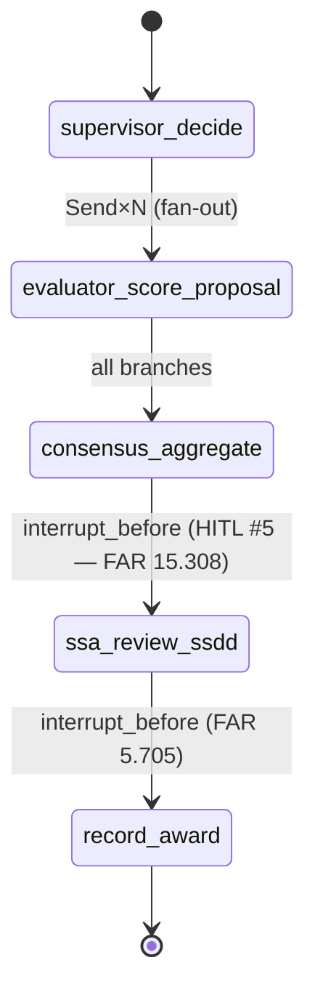

# Thursday Pre-Session — LangGraph deep-dive + HITL #5 hard interrupt

> [!NOTE]
> **From earlier:** Wed's supervisor routed to parallel evaluators via a *soft* interrupt — the supervisor proposed a next worker; the SSA approved. Today HITL #5 lands: no proposal, no default, no auto-proceed. The formal hard gate.

## 1. What you'll learn today

By the end of war-room you'll be able to:

- Design a typed LangGraph `StateGraph` with reducers for parallel writes.
- Wire dynamic fan-out with `Send` and fan-in to a single aggregator.
- Configure `PostgresSaver` correctly — `autocommit`, `row_factory`, `setup()`, and multi-tenant `thread_id`.
- Distinguish soft from hard interrupts at both the framework level and the audit-row schema level.
- Implement HITL #5 — the FAR 15.308 hard interrupt — with a defensible audit row and snapshot non-regeneration rule.

## 2. The day at a glance

The evaluator flow today is a LangGraph state machine:

| Topic | Focus | Reading min | Why today |
|-------|-------|------------:|-----------|
| 2. State schema | TypedDict, reducers, contract discipline | ~11 | Foundation for every node downstream |
| 3. Fan-out / fan-in | Send, super-step, partial-failure semantics | ~11 | Four parallel evaluators today |
| 4. Checkpointing | MemorySaver vs PostgresSaver, thread_id namespace | ~11 | 18-hour SSA gap must survive restarts |
| 5. Soft vs hard interrupts | Framework shapes, audit-row differences | ~11 | Name them before you wire them |
| 6. HITL #5 | FAR 15.308 hard gate, non-regeneration rule, audit trail | ~11 | ⭐ HITL touchpoint #5 of 7 |
| 7. Resiliency + LangSmith | Fault tolerance, task boundaries, tracing across interrupts | ~11 | Defense evidence is a LangSmith trace screenshot |
| 8. Cost + latency | OTel GenAI attributes, per-node instrumentation, fan-out multiplier | ~11 | W5 AIOps builds on what you wire today |

> [!IMPORTANT]
> **This is the last day new tech lands in W3.** Everything you wire today is what you defend tomorrow. HITL #5 is structurally distinct from #4 (soft, default exists) — today's gate blocks indefinitely; no timeout auto-resumes it.

## 3. Threading

- **HITL programme thread:** #5 of 7 — the formal `interrupt()` anchor. The hardest gate in the programme. FAR 15.308 non-delegation rule encoded in code.
- **Phase thread:** Phase 1 (AI Adoption) final technical day. Fri = Phase-1 Defense.
- **Pair-project:** SA-1/SA-2/SA-3 ADRs (opened Wed PM, D-040) feed the state-schema choices you make today.
- **Decision anchors:** D-033 (LangChain v1.0 posture), D-043 (HITL 7-touchpoint thread), D-044 (Karsun-aspect anchoring), D-060 (evaluator → consensus → SSA handoff).

## 4. Why today matters

The SSA's question frames the whole day: *"18 hours after consensus completed, when I click approve — are you recording what I approved, or regenerating the draft against today's RAG corpus?"* That one question forces four design moves: snapshot the SSDD draft into graph state at consensus completion; never re-invoke Bedrock on resume; two hard interrupts with no timeout; `actor_id = user:{ssa_id}`, not `"system"`. FAR 15.308 says the SSA's independent judgment cannot be delegated — not to a timer, not to a freshened model output.

PostgresSaver is what makes the 18-hour gap physically survivable. Without it the FastAPI process has to stay alive for 18 hours. Today you wire the persistence layer that makes hard interrupts viable in production.

> [!IMPORTANT]
> **Mid-Programme Gate countdown: 1 day.** What you ship today is the core of what you defend Friday. LangSmith trace screenshots showing the interrupt-pause-and-resume are on the defense rubric. Don't skip them.

## 5. How to read this

- Read topics 2–8 in order — state schema → fan-out → checkpointing → interrupt taxonomy → HITL #5 anchor → resiliency → cost.
- Self-checks at end of each topic — take 30s before expanding answers.
- Deeper-dives optional but recommended for senior FDEs.
- Hands-on exercises feed into morning war-room.
- Total expected time: **~84 min at 100 wpm** (pre-session only; war-room separate).

> [!CAUTION]
> **v0.x resume patterns are still on the open internet.** LangGraph v1.0 resumes via `Command(resume=...)` passed to `graph.invoke()`. Any source using `.run()` or calling `.resume()` directly is v0.x. Cite the v1.x docs.

## 6. Two questions to walk in with tomorrow

1. The SSA approves the SSDD draft 18 hours after consensus. The underlying FAR clause library was re-indexed overnight. Should the resume node call Bedrock to "freshen" the draft? Defend with the audit-trail reasoning.
2. You keyed `thread_id = evaluation_id`. Two agencies both create `evaluation_id = 4711` internally. What breaks, and what is the minimum fix?

Topic-to-war-room map

- Topic 2 (state schema) → War-room Act 1: lock `EvaluationState` TypedDict before any node code.
- Topic 3 (fan-out) → War-room Act 1: wire parallel evaluator dispatch via `Send`; confirm reducer on `evaluator_scores`.
- Topic 4 (checkpointing) → War-room Act 2: swap `MemorySaver` for `PostgresSaver`; run restart test.
- Topic 5 (soft vs hard) → War-room Act 2: audit-row schema whiteboard — HITL_SOFT_RESUME vs HITL_HARD_RESUME.
- Topic 6 (HITL #5) → War-room Act 3: `interrupt_before=["ssa_review_ssdd","record_award"]`; FAR 15.308 + FAR 5.705 citations.
- Topic 7 (resiliency) → War-room: Bedrock 429 scenario — resume-from-checkpoint without re-scoring; LangSmith trace.
- Topic 8 (cost) → War-room: wire OTel GenAI attributes on each node; set per-flow cost ceiling.

Consolidated sources

- LangGraph Interrupts: https://docs.langchain.com/oss/python/langgraph/interrupts — retrieved 2026-05-26
- LangGraph Persistence: https://docs.langchain.com/oss/python/langgraph/persistence — retrieved 2026-05-26
- LangGraph Graph API: https://docs.langchain.com/oss/python/langgraph/graph-api — retrieved 2026-05-26
- LangGraph low-level concepts: https://langchain-ai.github.io/langgraph/concepts/low_level/ — retrieved 2026-05-26
- PostgresSaver API: https://reference.langchain.com/python/langgraph.checkpoint.postgres/ — retrieved 2026-05-26
- LangGraph Durable Execution: https://docs.langchain.com/oss/python/langgraph/durable-execution — retrieved 2026-05-26
- FAR 15.308 Source Selection Decision: https://www.acquisition.gov/far/15.308 — retrieved 2026-05-26
- FAR 5.705 Publicizing Postaward: https://www.acquisition.gov/far/5.705 — retrieved 2026-05-26
- LangSmith Observability: https://docs.smith.langchain.com/observability/concepts — retrieved 2026-05-26
- OTel GenAI Semconv: https://opentelemetry.io/docs/specs/semconv/gen-ai/ — retrieved 2026-05-26
- Pregel paper: https://research.google/pubs/pregel-a-system-for-large-scale-graph-processing/ — retrieved 2026-05-26
- research/langchain-v1-20260522.md — LangChain v1.0 brief (D-033, hot-tech, in-range)

Last verified: 2026-06-06
