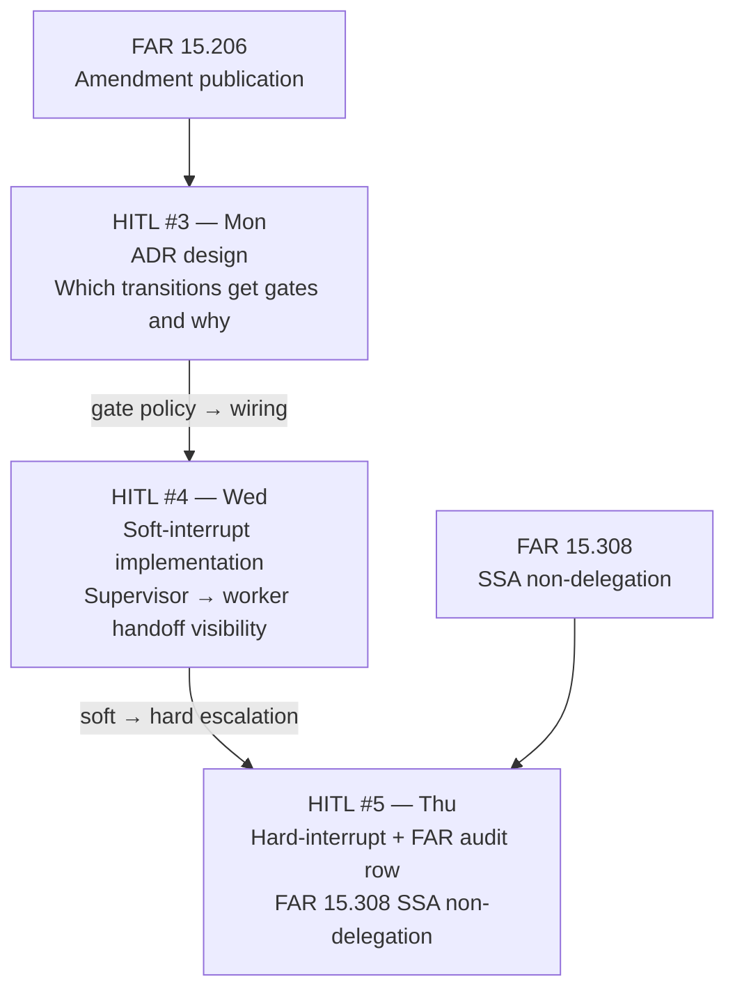

# W3 D1 Mon War-Room — What you're tackling today

> **Plan Day war-room.** Gate-boundary 1:1s 09:00–10:00. War-room 10:00–12:00. Plan-spec authoring PM. Last Plan Day before Phase 1 Gate.

## What we're tackling today + why

A Contracting Officer needs a multi-agent intake-triage flow by Friday. Vendors submit in bursts — 22 proposals arrived in a 90-minute TEP window and manual triage missed two amendments. She wants it automated, but **she — and only she — fires the irreversible actions.** That sentence is your HITL anchor for the week.

Topology and boundaries before code. Sketch the agent shape, name which transitions are reversible vs irreversible, and walk into the PM plan-spec block with a draft HITL #3 ADR. Mon–Tue: single-agent ReAct. Wed–Fri: evaluator → consensus → SSA.

## ADR traceability — HITL shapes across the week

Three distinct shapes — keep them named separately. Do not import Thu's FAR 15.308 gate into today's ADR. Today is intake scope only.

> [!NOTE]
> By 09:00 you should have skimmed your pair's frontmatter and skim-read overview Sec 4 (Why today matters). The war-room whiteboard exercise starts at 10:00 sharp — arrive with a rough topology sketch already in your head.

## What to know walking in

- Pre-session topics 2–7 read — irreversibility principle, state-machine model, memory patterns, eval-driven dev, §0 retro, HITL #3 ADR anatomy.
- LangGraph + LangChain v1.0 + Bedrock InvokeModel only (no Agents-for-Bedrock until W5, per D-050).
- FAR 15.206 (amendments) + FAR 15.308 (SSA cannot delegate) bookmarked — know which applies today vs Thu.
- Container-first dev stack green; `ai-orchestrator` reachable.
- Gate-boundary 1:1 slot confirmed (20 min per pair, 09:00–10:00).
- W2 retro outcomes top-of-mind — §0 runs **first** in the PM block, before the three ADRs.

## EOD deliverable (Mon 17:00)

1. **Whiteboard photo** of intake-triage topology committed to pair-repo (`docs/W3-D1-topology.png`).
2. **Annotated tool list** — read vs write, idempotency notes on writes.
3. **Pair plan-spec for W3 Tue–Fri** (`templates/week-plan-spec.md`) with §0 retro on W2 (mandatory per D-036) + three ADRs: single vs multi-agent · LangGraph as framework · **HITL #3 interrupt-node boundaries** with FAR citations.
4. **Open-question list** — three to five questions for Tue morning.

> [!TIP]
> **ADR commit message shape:** `feat(adr): adopt agentic pattern for <your-aspect> — HITL-3 wired at <node-name>`. One line, one decision, one node. This makes the pair-repo history searchable at Phase-1 Gate review.

> [!IMPORTANT]
> **Plan-spec integrity check at 17:00.** Instructor signs off each pair's plan before Tuesday morning. If §3 ADRs are hedges instead of decisions ("we might use a soft gate or possibly a hard gate depending"), the pair revises before Tuesday. Each gate decision must complete one sentence: "This is a [hard/soft/no] gate because [FAR clause X / outside world observes Y]."

Reference

- Source: `weeks/W03/PLAN.md` Mon row · `pre-session/1-Monday/1-DailyTopicOverview.md`
- Templates: `templates/week-plan-spec.md`
- Research: `research/langchain-v1-20260522.md` · `research/bedrock-claude-catalog-20260522.md`
- HITL thread: #3 today (ADR), #4 Wed (soft interrupt implementation), #5 Thu (hard interrupt + FAR audit row)
- FAR clauses: 15.206 (amendments — today), 15.308 (SSA non-delegation — Thu only)
- Tomorrow: `pre-session/2-Tuesday/1-DailyTopicOverview.md`. **Checkpoint 1 exam in-person 09:00–10:30.**

Last verified: 2026-06-06
