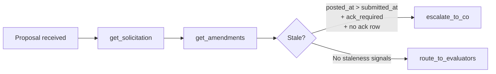

# W3 D2 Tue War-Room — What you're tackling today

> [!NOTE]
> **From earlier:** W2 Thu's envelope-shaping session established HITL boundary discipline. Mon's ADR committed the agent topology and the HITL #3 boundary. Today you wire the loop.

> **Half-day war-room.** Checkpoint 1 exam in-person 09:00–10:30 (90 min). War-room begins **10:30 post-exam**, runs to 12:00. Audit interviews are per-candidate 30-min Zoom sessions scheduled async on your free time — NOT in the morning block.

## What we're tackling today + why

A vendor (Acme Cloud Services) submitted a proposal to RFP-2026-GSA-1184. The CO amended that solicitation **yesterday at 16:30** — Section L page-count change, mandatory acknowledgement required. Acme's cover letter references the old 50-page limit. Their proposal is 48 pages (accidentally fine) — but the cover-letter reference is stale and the acknowledgement is missing.

Reject, re-route, or flag?

First real LangGraph code lands today. The intake-triage flow goes from blank FastAPI endpoint to a working single-agent ReAct loop that **detects staleness on signals the agent can verify** — timestamps and acknowledgement state — not cover-letter prose. LangSmith tracing live for the first time (per D-031). The CO is asking you to **design the policy AND build it.**

## What to know walking in

- Exam (90 min, in-person) covers W1 Thu–Fri + W2 — no laptops during exam block.
- Pre-session readings 2–7 read — ReAct loop + tool discipline + idempotency + compaction + agentic RAG + LangSmith.
- Mon's plan-spec merged with the three ADRs from HITL #3.
- LangSmith wired into `ai-orchestrator/.env`. If not, that is your 10:30 first move — Wed debug depends on today's traces.
- Five tools ready: `get_solicitation`, `get_amendments`, `score_completeness`, `route_to_evaluators`, `escalate_to_co` (3 read, 2 write).
- FAR 15.206(c): proposals submitted after an amendment must reflect the amended terms.
- W2 `POST /rag/clause-search` is callable as an agent tool today — first programme appearance as an agent tool.

## EOD deliverable (Tue 17:00)

1. **Working `POST /agent/intake-triage`** detecting staleness on three signals: `Amendment.posted_at > Proposal.submitted_at` AND `Amendment.requires_acknowledgement = true` AND no ack row in `proposal_amendment_acknowledgements`.
2. **Idempotent write tools** — documented idempotency keys; no duplicate AuditEvents on graph resume.
3. **LangSmith trace screenshot** showing detection + escalation path in the cohort workspace.
4. **Pytest:** happy-path · staleness-detected-no-ack-escalate · idempotent-escalation (second call = no-op).
5. **ADR** in pair-repo: *"Staleness response policy — re-route vs reject vs flag"* citing FAR 15.206(c).
6. **Codex Adversarial Review** on the PR at Near-full strictness (per D-034).

References

- `weeks/W03/PLAN.md` Tue row
- `pre-session/2-Tuesday/1-DailyTopicOverview.md`
- `research/langchain-v1-20260522.md` · `research/bedrock-claude-catalog-20260522.md`
- FAR 15.206(c) — amendment acknowledgement requirement
- Tomorrow: `pre-session/3-Wednesday/1-DailyTopicOverview.md` (multi-agent + KG/CG + HITL #4)

Last verified: 2026-06-06
