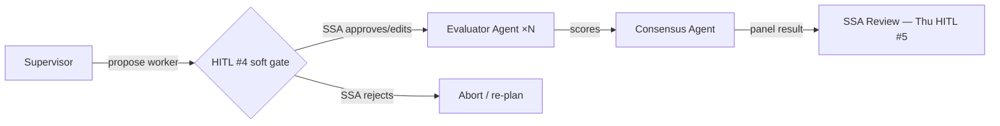

# W3 D3 Wed War-Room — What you're tackling today

> [!NOTE]
> **From earlier:** Tue's single-agent intake-triage PR merged. Today it hands off into the harder shape: evaluator-agent → consensus-agent → SSA-review-agent. HITL #4 lands at the supervisor → worker boundary.

## What we're tackling today

Three concurrent RFP evaluations kick off: RFP-2026-GSA-1184 (cloud), 1199 (cyber), 1204 (mobile). Six evaluators each. The SSA wants visibility into the supervisor's decisions *before* consensus completes — approve or override what's *about to* be delegated, not wait for the SSDD review.

That's HITL #4 — a **soft interrupt at the supervisor → worker handoff.**

Today's shape: soft interrupt (suggested default, human approves/edits/rejects). Thu's shape: hard interrupt — no default, blocks until FAR 15.308 judgment is made. Do not pre-collapse them.

## What to know walking in

- Pre-session read — supervisor-worker + multi-agent anti-patterns + KG/CG thinking.
- LangGraph `interrupt_before` reviewed; static compile-time gate is today's canonical wiring.
- FAR 15.308 sets up Thu's hard gate; today's soft gate is the *advisory* precursor.
- Two brownfield items surface today live: **Item 2** (audit-log race — 72 rows fanning into one Postgres write) and **Item 6** (correlation IDs missing from `EvaluationState`).

> [!IMPORTANT]
> **HITL #4 is soft, not hard.** The supervisor proposes a default worker call; the SSA approves, edits, or rejects via `Command(resume=...)`. Auto-approve on timeout is wrong even for the soft gate — the calendar is the constraint, not the graph's patience.

## EOD deliverable (Wed 17:00)

1. **Supervisor-worker scaffolding** — supervisor + evaluator-agent end-to-end against `EvaluationState`.
2. **`interrupt_before=["supervisor_decide_next_worker"]`** configured; soft interrupt fires; resume via `Command(resume=...)` works in a unit test.
3. **Single audit-writer pattern** — one utility emits `AuditEvents` from `EvaluationState.audit_correlation_id`. No fan-out.
4. **LangSmith trace** showing supervisor decision → pause → SSA-approval → worker → result loop.
5. **Three SA prompts opened** — SA-1 (single vs multi for intake-triage), SA-2 (LangGraph vs LangChain vs hand-rolled), SA-3 (Neo4j vs Postgres CTE vs NetworkX). Full ADRs due Thu W4.
6. **Pair-retro note** on Item 3 (no circuit breaker eval→solicitation-service) — fix lands W5; name it today.

## Reference

Sources and links

- Source: `weeks/W03/PLAN.md` Wed row · `pre-session/3-Wednesday/1-DailyTopicOverview.md`
- Research: `research/langchain-v1-20260522.md`
- Scenarios: `scenarios/W03-SA-1.md`, `W03-SA-2.md`, `W03-SA-3.md`
- FAR 15.308 (SSA decision authority — cannot delegate): https://www.acquisition.gov/far/15.308
- Tomorrow: `pre-session/4-Thursday/1-DailyTopicOverview.md` — HITL #5 hard interrupt + LangGraph state-machine deep-dive

Last verified: 2026-06-06
