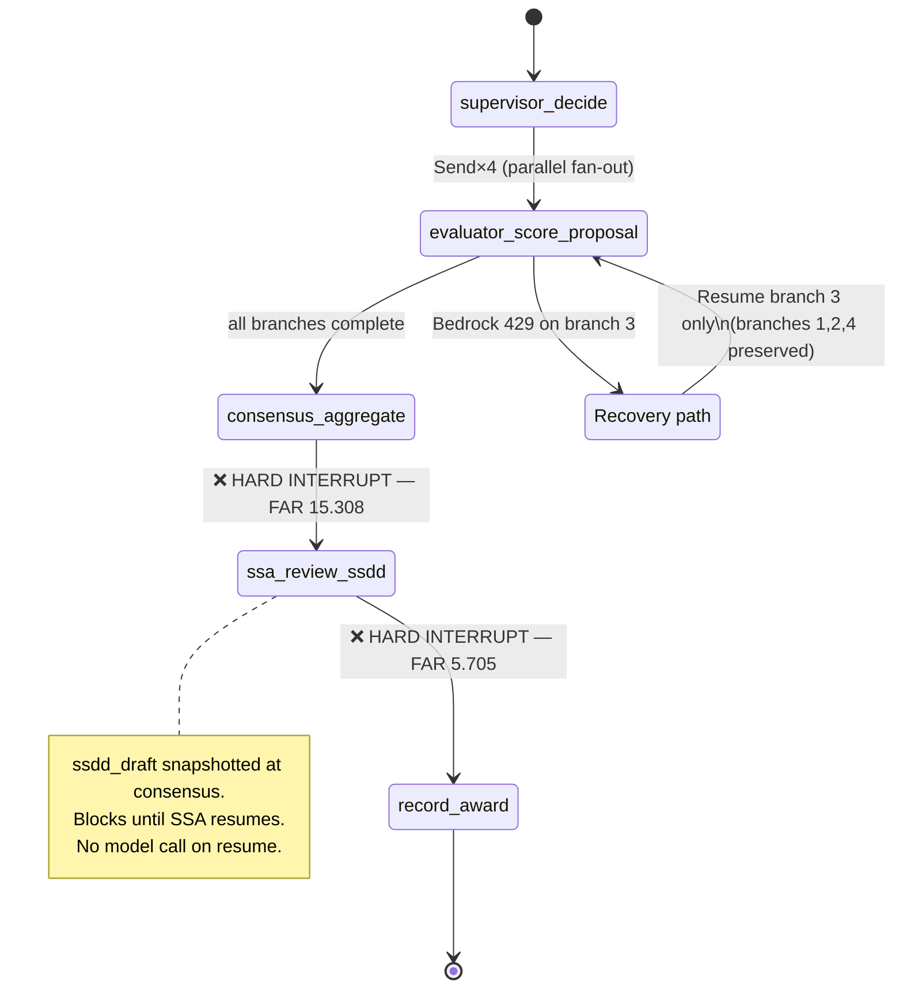

# W3 D4 Thu War-Room — What you're tackling today

> **HITL #5 technical anchor.** Full evaluator → consensus → SSA-review LangGraph state machine ships by 17:00. Hard `interrupt_before` at both SSA boundaries. PostgresSaver surviving an 18-hour gap. Audit rows citing FAR 15.308 on resume. Deepest LangGraph day of the programme.

## What we're tackling today + why

The SSA speaks: *"Your supervisor agent fanned out RFP-2026-GSA-1184 to four evaluators yesterday. Consensus completed at 23:00. It's now 17:00 — **18 hours later.** I have 15 minutes. When I click approve, is your system going to record what I approved, or regenerate the draft against today's RAG corpus because the FAR was amended this morning? Because if it regenerates, my approval isn't on the document I read."*

That is a FAR 15.308 violation question. The SSA's independent judgment cannot be delegated to a "fresh-context regeneration." By 17:00 the answer is in code.

The state machine that resolves it:

The four design moves the SSA's question forces: (1) snapshot `ssdd_draft` into `EvaluationState` at consensus completion — never touch it again; (2) never re-invoke Bedrock on resume — the resume node is a pure state transition; (3) two hard `interrupt_before` entries with no timeout; (4) `actor_id = f"user:{ssa_user_id}"` on the audit row, not `"system"`.

## What to know walking in

- Pre-session topics 2–8 read — state schema, fan-out, checkpointing, soft vs hard interrupts, HITL #5, resiliency, cost instrumentation.
- Wed's supervisor-worker scaffolding merged; soft interrupt (#4) working in unit test.
- FAR 15.308 + FAR 5.705 read carefully — non-negotiable for the audit-row design.
- PostgresSaver tutorial skimmed — full wire against acquire-gov Postgres lands today.
- **Phase 1 Defense rubric** preview: what you ship today is most of what you defend tomorrow.

## EOD deliverable (Thu 17:00)

1. **Full `evaluator → consensus → ssa_review_ssdd → record_award` state machine** — wired, tested, two hard `interrupt_before` nodes.
2. **PostgresSaver** against acquire-gov Postgres; thread keys `f"{agency_id}:{evaluation_id}"` (Item 10 multi-tenant fix).
3. **Audit row schema** with `far_citation` on every `HITL_HARD_RESUME` — `"15.308"` for SSA, `"5.705"` for award.
4. **Restart test passing** — FastAPI Ctrl+C → restart → resume reads same draft text (not regenerated) → `record_award` runs → audit rows correct.
5. **LangSmith trace** captured + screenshotted — interrupt-pause gap visible in the timeline. Defense evidence.
6. **Cost + latency instrumentation** — OTel GenAI attributes on each node (token-per-node + latency-per-node).
7. **Codex Adversarial Review** on the PR. Expect findings on thread-id namespace, audit row completeness, resume-payload validation, and lack-of-timeout being *correct* (auto-timeout is the regulatory anti-pattern here).

Reference

- Source: `weeks/W03/PLAN.md` Thu row · `pre-session/4-Thursday/1-DailyTopicOverview.md`
- Research: `research/langchain-v1-20260522.md`
- FAR 15.308 (SSA non-delegation): https://www.acquisition.gov/far/15.308 — retrieved 2026-05-26
- FAR 5.705 (award publication irreversible): https://www.acquisition.gov/far/5.705 — retrieved 2026-05-26
- Phase 1 Defense rubric (preview): `assessments/W03-Phase1-Defense-rubric.md`
- Tomorrow: `pre-session/5-Friday/1-DailyTopicOverview.md` — Phase 1 Gate framing (short). **Friday is the Gate, not a war-room day.**

Last verified: 2026-06-06
